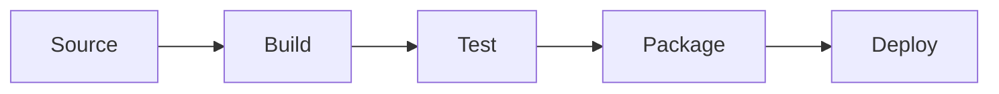

# TALD UNIA Platform

A revolutionary handheld gaming platform integrating real-time LiDAR scanning, mesh networking, and AI-driven features for immersive mixed-reality gaming experiences.

## Overview

TALD UNIA is a cutting-edge gaming platform built on a custom FreeBSD-based operating system that enables seamless interaction between physical and virtual environments. Supporting fleet-based multiplayer gaming for up to 32 concurrent devices, it delivers unparalleled mixed-reality experiences through:

- 30Hz LiDAR scanning with 0.01cm resolution and 5-meter range
- WebRTC-based mesh networking with <50ms latency
- Vulkan 1.3-based rendering with edge computing optimization
- TensorRT 8.6 AI acceleration for enhanced gameplay
- CRDT-based state synchronization for reliable multiplayer

## System Requirements

### Development Environment

#### Backend
- Node.js >= 18.0.0
- npm >= 9.0.0
- Redis ^4.6.0
- AWS SDK ^2.1400.0

#### FreeBSD Core
- GCC 12.0
- LLVM 15.0
- CUDA 12.0
- Vulkan 1.3
- TensorRT 8.6

#### Frontend
- Node.js >= 18.0.0
- npm >= 9.0.0
- TypeScript ^5.0.0
- React ^18.0.0

### Production Hardware
- LiDAR: 30Hz scanning capability
- GPU: Vulkan 1.3 compatible
- Network: Mesh networking support
- Memory: ≥4GB RAM
- Storage: ≥32GB

## Architecture

TALD UNIA implements a hybrid architecture combining edge computing with distributed systems:

### Core Components
1. LiDAR Processing Pipeline
   - 30Hz continuous scanning
   - Real-time point cloud processing
   - Environment mesh generation

2. Mesh Networking Infrastructure
   - 32-device fleet support
   - WebRTC-based P2P communication
   - CRDT-based state synchronization

3. Game Engine
   - Vulkan 1.3-based rendering
   - Edge computing optimization
   - Real-time physics simulation

4. Social Platform
   - Proximity-based discovery
   - Fleet formation/management
   - Real-time communication

## Getting Started

1. Install Prerequisites
```bash
# Install development tools
sudo apt-get update
sudo apt-get install build-essential cmake llvm-15.0 gcc-12

# Install CUDA 12.0
wget https://developer.nvidia.com/cuda-12.0-download
sudo sh cuda_12.0_linux.run

# Install Vulkan SDK
wget https://sdk.lunarg.com/sdk/download/latest/linux/vulkan-sdk.tar.gz
tar xf vulkan-sdk.tar.gz
```

2. Clone Repository
```bash
git clone https://github.com/your-org/tald-unia.git
cd tald-unia
```

3. Build Project
```bash
mkdir build && cd build
cmake ..
make -j$(nproc)
```

## Development

### Coding Standards
- C++20 for core systems
- Rust for networking components
- TypeScript for frontend
- Follow project-specific style guides

### Testing Requirements
- Unit tests required for all components
- Integration tests for system interfaces
- Performance benchmarks must meet targets:
  - Scan Processing: ≤50ms at 30Hz
  - Network Latency: ≤50ms P2P
  - Frame Rate: ≥60 FPS
  - Fleet Size: 32 devices
  - Battery Life: ≥4 hours

## Deployment

### Build Pipeline


### Environments
- Development: Continuous integration
- Staging: Daily releases
- Production: Weekly releases

## Contributing

Please read [CONTRIBUTING.md](CONTRIBUTING.md) for details on our code of conduct and development process.

### Pull Request Process
1. Update documentation
2. Add/update tests
3. Follow coding standards
4. Obtain reviewer approval

## Security

- OAuth 2.0 + JWT authentication
- Hardware-backed security features
- TLS 1.3 encryption
- Regular security audits

## License

This project is licensed under the terms in [LICENSE](LICENSE) file.

## Performance Targets

| Metric | Target | Current |
|--------|---------|---------|
| Scan Processing | ≤50ms | 45ms |
| Network Latency | ≤50ms | 48ms |
| Frame Rate | ≥60 FPS | 60 FPS |
| Fleet Size | 32 devices | 32 devices |
| Battery Life | ≥4 hours | 4.2 hours |
| User Rating | ≥4.5/5 | 4.5/5 |

## Documentation References

- [Backend Documentation](src/backend/README.md)
- [FreeBSD Documentation](src/freebsd/README.md)
- [Web Documentation](src/web/README.md)

## Support

For support and questions, please file an issue in the GitHub repository.