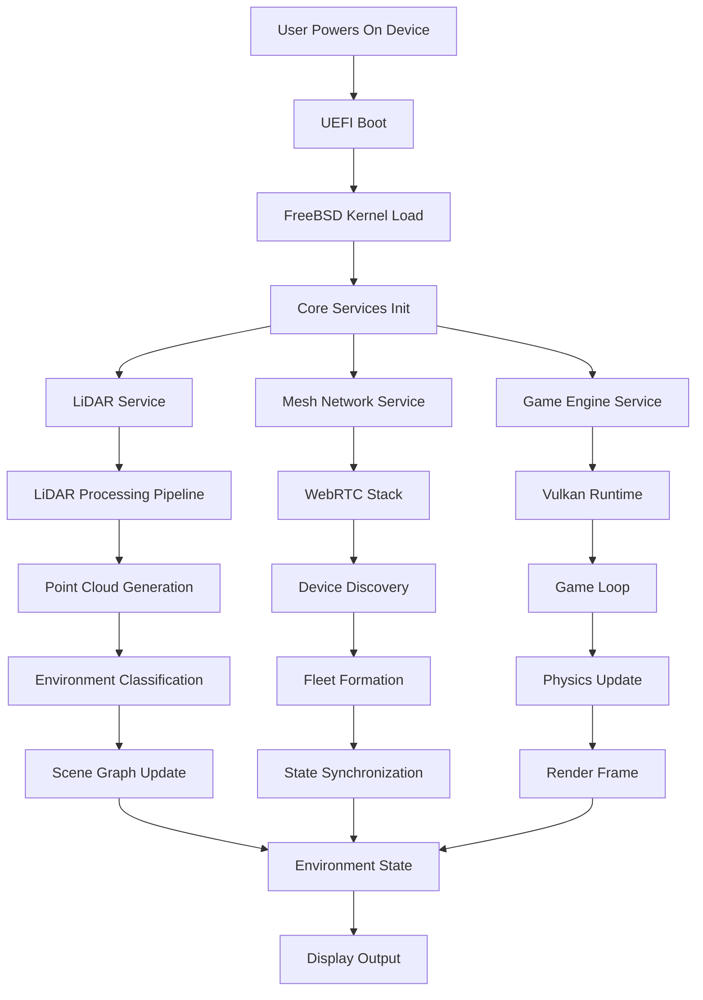
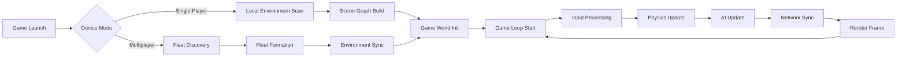
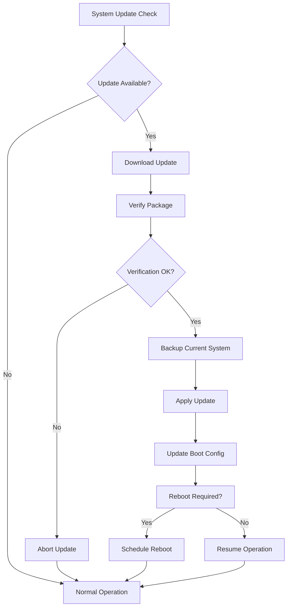
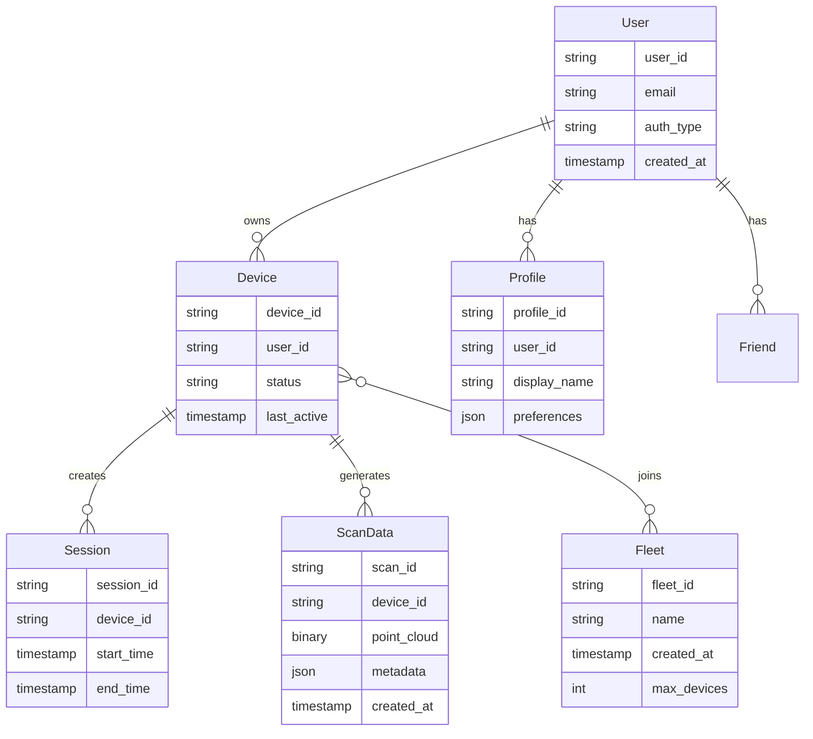
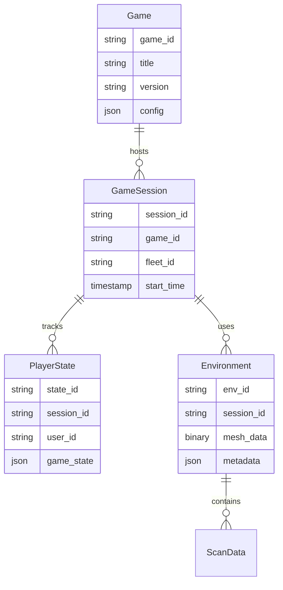
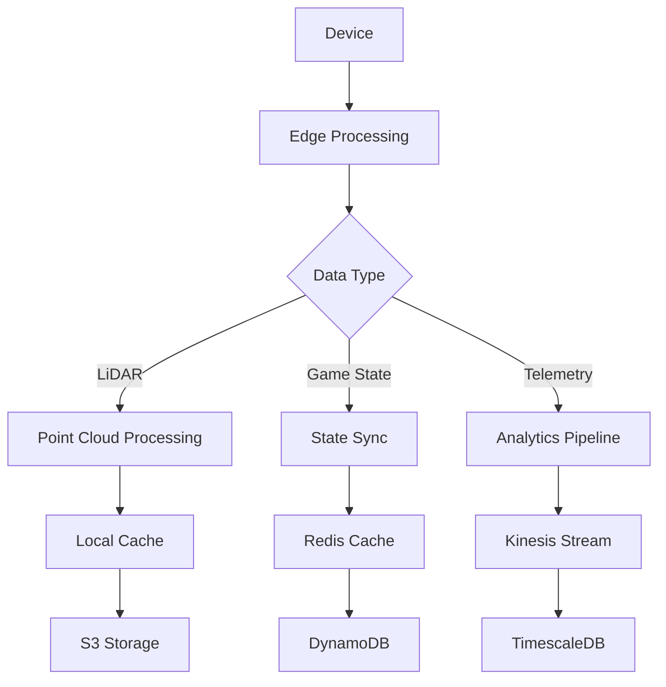

# Product Requirements Document (PRD)

# 1. INTRODUCTION

## 1.1 Purpose

This Software Requirements Specification (SRS) document provides a comprehensive description of the TALD UNIA operating system - a custom FreeBSD-based OS designed specifically for the TALD UNIA handheld gaming platform. This document serves as the primary reference for technical teams, stakeholders, and third-party developers by detailing functional and non-functional requirements, system architecture, and implementation guidelines.

## 1.2 Scope

The TALD UNIA OS is a highly specialized operating system that powers the TALD UNIA handheld gaming platform, integrating real-time LiDAR scanning, mesh networking, and AI-driven features. The system builds upon FreeBSD 9.0 foundations while incorporating custom components for gaming and social experiences.

### Core Functionalities

- Real-time LiDAR processing pipeline supporting 30Hz scanning at 0.01cm resolution
- WebRTC-based mesh networking enabling 32-device fleet connectivity
- Proximity-based social gaming and environment sharing
- GPU-accelerated game engine utilizing Vulkan SDK 1.3
- Custom UI layer optimized for handheld gaming

### Key Benefits

- Seamless integration of physical and virtual environments through LiDAR
- Low-latency multiplayer experiences via mesh networking
- Enhanced social gaming through proximity-based features
- Optimized performance through edge computing principles
- Robust security framework protecting user data and gameplay

### Target Users

- Gaming enthusiasts seeking immersive mixed-reality experiences
- Social gamers interested in local multiplayer interactions
- Game developers creating content for the platform
- Enterprise clients deploying fleet-based solutions
- Institutional users implementing location-based experiences

### Out of Scope

- General-purpose computing functionality
- Support for non-gaming applications
- Third-party operating system installations
- Direct hardware modifications
- Unauthorized system access or jailbreaking

# 2. PRODUCT DESCRIPTION

## 2.1 Product Perspective

The TALD UNIA OS operates as a specialized gaming platform within a larger ecosystem of interconnected handheld devices. Built on FreeBSD 9.0 foundations, it integrates with:

- LiDAR hardware subsystem for environmental scanning
- Mesh networking infrastructure for device-to-device communication
- Cloud services for user data and content delivery
- Social gaming platform for multiplayer experiences
- Development tools and SDKs for content creation

## 2.2 Product Functions

The TALD UNIA OS provides these core functions:

- Real-time LiDAR scanning and processing at 30Hz with 0.01cm resolution
- WebRTC-based mesh networking supporting 32-device fleets
- GPU-accelerated game engine using Vulkan 1.3
- Proximity-based social gaming and environment sharing
- Edge computing for local game logic and physics
- Over-the-air system and game updates
- User authentication and profile management
- Content marketplace and distribution
- Development tools and APIs

## 2.3 User Characteristics

### Primary Users: Gaming Enthusiasts
- Age range: 13-45 years
- Tech-savvy with gaming experience
- Interest in social and mixed-reality gaming
- Comfortable with mobile/handheld devices
- Varying levels of disposable income

### Secondary Users: Game Developers
- Professional game development experience
- Familiarity with C++, Rust, and game engines
- Understanding of 3D graphics and networking
- Need for comprehensive documentation and tools

### Enterprise Users
- Business/institutional deployment focus
- Require fleet management capabilities
- Emphasis on security and control features
- Need for usage analytics and reporting

## 2.4 Constraints

### Technical Constraints
- Hardware processing limitations for LiDAR data
- Battery life considerations for mobile operation
- Network bandwidth and latency requirements
- Storage capacity for games and user data
- Device memory allocation limits

### Regulatory Constraints
- GDPR/CCPA compliance requirements
- Age-appropriate content restrictions
- Data privacy and security regulations
- Export control compliance
- Wireless certification requirements

### Operational Constraints
- Maximum 32 devices per mesh network
- 5-meter effective LiDAR range
- Minimum 10Mbps network bandwidth per device
- 50ms maximum network latency
- Real-time processing requirements

## 2.5 Assumptions and Dependencies

### Assumptions
- Users have reliable internet connectivity
- Devices operate within specified temperature range
- Users accept privacy policy and data collection
- Developers follow platform guidelines
- Hardware meets minimum specifications

### Dependencies
- FreeBSD 9.0 core operating system
- Vulkan SDK 1.3 availability
- WebRTC protocol support
- Cloud service providers (AWS)
- Third-party authentication services
- Development toolchain components
- Hardware component suppliers

# 3. PROCESS FLOWCHART

# 4. FUNCTIONAL REQUIREMENTS

## 4.1 LiDAR Processing System

### ID: FR-L1
### Description
Real-time environmental scanning and processing pipeline using onboard LiDAR hardware
### Priority
Critical (P0)

| Requirement ID | Requirement Description | Acceptance Criteria |
|----------------|------------------------|-------------------|
| FR-L1.1 | System must maintain 30Hz continuous scanning rate | - Verified scanning rate ≥30Hz - Consistent frame timing within 5% variance |
| FR-L1.2 | Point cloud resolution must be 0.01cm or better | - Measured point accuracy ≤0.01cm - Uniform point distribution |
| FR-L1.3 | Maximum effective scanning range of 5 meters | - Reliable data collection at 5m - Graceful degradation beyond range |
| FR-L1.4 | Processing latency under 50ms | - End-to-end processing time ≤50ms - No frame drops under load |

## 4.2 Mesh Networking

### ID: FR-M1
### Description
WebRTC-based mesh network enabling device-to-device communication and fleet formation
### Priority
Critical (P0)

| Requirement ID | Requirement Description | Acceptance Criteria |
|----------------|------------------------|-------------------|
| FR-M1.1 | Support up to 32 simultaneously connected devices | - Stable operation with 32 nodes - Graceful performance degradation |
| FR-M1.2 | Network latency under 50ms for all connections | - P2P latency ≤50ms - Consistent performance across fleet |
| FR-M1.3 | Automatic fleet formation and management | - Self-organizing network topology - Automatic node discovery/recovery |
| FR-M1.4 | State synchronization across all nodes | - CRDT-based consistency - Conflict resolution within 100ms |

## 4.3 Game Engine Integration

### ID: FR-G1
### Description
Vulkan-based game engine providing rendering and physics simulation
### Priority
Critical (P0)

| Requirement ID | Requirement Description | Acceptance Criteria |
|----------------|------------------------|-------------------|
| FR-G1.1 | GPU-accelerated rendering using Vulkan 1.3 | - 60 FPS minimum framerate - Vulkan validation layer compliance |
| FR-G1.2 | Real-time physics simulation | - Physics updates at 120Hz - Deterministic simulation results |
| FR-G1.3 | Environment mesh integration | - Seamless LiDAR data incorporation - Dynamic collision mesh updates |
| FR-G1.4 | Multi-threaded game logic processing | - Core utilization >80% - Thread-safe state management |

## 4.4 Social Features

### ID: FR-S1
### Description
Proximity-based social gaming and environment sharing capabilities
### Priority
High (P1)

| Requirement ID | Requirement Description | Acceptance Criteria |
|----------------|------------------------|-------------------|
| FR-S1.1 | Proximity-based player discovery | - Detection range up to 10m - Update rate ≥1Hz |
| FR-S1.2 | Real-time environment sharing | - Environment sync within 200ms - Bandwidth usage ≤10Mbps |
| FR-S1.3 | In-game chat and communication | - Voice latency ≤100ms - Text message delivery ≤50ms |
| FR-S1.4 | Friend list and social graph management | - 1000 friends per user maximum - Instant status updates |

## 4.5 System Management

### ID: FR-Y1
### Description
Core system services for device management and updates
### Priority
High (P1)

| Requirement ID | Requirement Description | Acceptance Criteria |
|----------------|------------------------|-------------------|
| FR-Y1.1 | Over-the-air system updates | - Delta updates ≤100MB - Automatic recovery on failure |
| FR-Y1.2 | Performance monitoring and telemetry | - ≤1% CPU overhead - 24-hour metric retention |
| FR-Y1.3 | Power management and optimization | - 4+ hours battery life - Thermal limits maintained |
| FR-Y1.4 | Security policy enforcement | - Real-time threat detection - Automatic security responses |

# 5. NON-FUNCTIONAL REQUIREMENTS

## 5.1 Performance Requirements

| Requirement | Description | Target Metric |
|-------------|-------------|---------------|
| Processing Speed | LiDAR data processing and point cloud generation | ≤50ms latency at 30Hz |
| Network Performance | Mesh network communication between devices | ≤50ms P2P latency |
| Graphics Performance | Game engine rendering and frame delivery | 60 FPS minimum |
| Memory Usage | Runtime memory consumption | ≤4GB RAM usage |
| Storage Usage | System and application storage | ≤32GB system partition |
| Battery Life | Continuous gaming operation | ≥4 hours at full load |
| Thermal Management | CPU/GPU temperature control | ≤85°C under load |

## 5.2 Safety Requirements

| Requirement | Description | Implementation |
|-------------|-------------|----------------|
| Data Backup | Automatic backup of user data and settings | Daily incremental backups |
| Failure Recovery | System recovery from crashes or corruption | Dual boot partitions |
| Hardware Protection | Prevention of hardware damage | Thermal throttling |
| Error Handling | Graceful handling of system errors | Error logging and reporting |
| Update Safety | Safe system update mechanism | Atomic updates with rollback |
| Emergency Shutdown | Controlled shutdown on critical failure | State preservation |
| Data Integrity | Prevention of data corruption | Journaling filesystem |

## 5.3 Security Requirements

| Requirement | Description | Implementation |
|-------------|-------------|----------------|
| Authentication | User identity verification | OAuth 2.0 + RBAC |
| Authorization | Access control to system resources | JWT-based sessions |
| Data Encryption | Protection of sensitive data | AES-256-GCM |
| Network Security | Secure communication | TLS 1.3, DTLS 1.3 |
| Hardware Security | Protection of hardware resources | Secure boot, TPM 2.0 |
| Privacy Controls | User data privacy protection | Data minimization |
| Vulnerability Management | Security patch deployment | Monthly security updates |

## 5.4 Quality Requirements

### 5.4.1 Availability
- System uptime: 99.9%
- Planned maintenance: ≤4 hours/month
- Unplanned downtime: ≤1 hour/month
- Service degradation: ≤2 hours/month

### 5.4.2 Maintainability
- Mean Time To Repair (MTTR): ≤4 hours
- Code coverage: ≥85%
- Documentation coverage: 100%
- Technical debt ratio: ≤5%

### 5.4.3 Usability
- First-time user success rate: ≥90%
- Task completion time: ≤30 seconds
- Error rate: ≤1%
- User satisfaction score: ≥4.5/5

### 5.4.4 Scalability
- Maximum concurrent users per fleet: 32
- Linear performance scaling to 32 nodes
- Resource utilization scaling: ≤120%
- Network bandwidth per device: ≤10Mbps

### 5.4.5 Reliability
- Mean Time Between Failures (MTBF): ≥5000 hours
- Error rate under load: ≤0.1%
- Data loss probability: ≤0.001%
- Recovery success rate: ≥99.9%

## 5.5 Compliance Requirements

| Requirement | Description | Standard/Regulation |
|-------------|-------------|-------------------|
| Data Protection | User data handling and privacy | GDPR, CCPA |
| Authentication Standards | Identity verification methods | NIST 800-63 |
| Security Controls | System security measures | ISO 27001 |
| Gaming Regulations | Content and monetization | ESRB, PEGI |
| Hardware Safety | Device safety standards | CE, FCC, UL |
| Environmental | Environmental impact | RoHS, WEEE |
| Accessibility | Interface accessibility | WCAG 2.1 |

# 6. DATA REQUIREMENTS

## 6.1 Data Models

### 6.1.1 Core Entities

### 6.1.2 Game Data Model

## 6.2 Data Storage

### 6.2.1 Storage Requirements

| Data Type | Storage Location | Retention Period | Backup Frequency |
|-----------|-----------------|------------------|------------------|
| User Profiles | DynamoDB | Indefinite | Daily |
| Session Data | Redis + DynamoDB | 30 days | Hourly |
| LiDAR Scans | S3 + Local Cache | 7 days | Real-time |
| Game States | Redis + DynamoDB | Session duration | Real-time |
| Fleet Data | DynamoDB | Active + 30 days | Hourly |
| Telemetry | TimescaleDB | 90 days | Daily |

### 6.2.2 Redundancy and Replication

- Multi-AZ deployment for DynamoDB tables
- S3 cross-region replication for scan data
- Redis cluster with automatic failover
- Daily snapshots stored in S3 Glacier
- Point-in-time recovery enabled for critical tables

### 6.2.3 Backup and Recovery

- Automated daily backups of all databases
- Incremental backups for large datasets
- 30-day backup retention for system data
- 7-day retention for game session data
- Recovery time objective (RTO): 1 hour
- Recovery point objective (RPO): 5 minutes

## 6.3 Data Processing

### 6.3.1 Data Flow

### 6.3.2 Data Security

| Security Layer | Implementation | Purpose |
|----------------|----------------|----------|
| Encryption at Rest | AES-256-GCM | Protect stored data |
| Encryption in Transit | TLS 1.3 | Secure data transfer |
| Access Control | RBAC + JWT | Authorization |
| Key Management | AWS KMS | Key rotation and management |
| Data Masking | Field-level encryption | PII protection |
| Audit Logging | CloudWatch + CloudTrail | Security monitoring |

### 6.3.3 Data Processing Requirements

| Process | Latency Target | Throughput Target |
|---------|----------------|-------------------|
| LiDAR Processing | <50ms | 30Hz per device |
| State Synchronization | <100ms | 1000 ops/sec per fleet |
| Analytics Processing | <5min | 10GB/hour per fleet |
| Backup Processing | <4 hours | 1TB/day |
| Search Indexing | <1min | 100 docs/sec |

# 7. EXTERNAL INTERFACES

## 7.1 USER INTERFACES

### 7.1.1 Dynamic Menu System

| Interface Element | Description | Requirements |
|------------------|-------------|--------------|
| Main Menu | Primary navigation hub | - 60 FPS animation smoothness - ≤16ms input latency - Context-sensitive layout |
| Game Library | Game collection and launch interface | - Grid/list view toggle - Sort/filter options - Quick launch support |
| Social Hub | Friend list and communication center | - Real-time status updates - Proximity player indicators - Fleet management UI |
| Settings Panel | System configuration interface | - Category-based organization - Search functionality - Quick settings access |

### 7.1.2 In-Game Overlay

| Element | Description | Requirements |
|---------|-------------|--------------|
| LiDAR Visualization | Real-time environment scan display | - Point cloud visualization - Mesh wireframe toggle - Scan quality indicators |
| Fleet Status | Connected device information | - Device count/status - Network quality metrics - Fleet position map |
| Performance HUD | System performance indicators | - FPS counter - Network latency - Battery status |

## 7.2 HARDWARE INTERFACES

### 7.2.1 LiDAR Subsystem

| Interface | Specification | Requirements |
|-----------|--------------|--------------|
| Sensor Input | Raw point cloud data stream | - 30Hz scan rate - 0.01cm resolution - 5m effective range |
| Data Bus | PCIe Gen 4 x4 | - 7.88 GB/s bandwidth - DMA support - Interrupt handling |
| Processing Unit | Custom ASIC | - Hardware acceleration - Power management - Thermal monitoring |

### 7.2.2 Display System

| Interface | Specification | Requirements |
|-----------|--------------|--------------|
| GPU Interface | Vulkan 1.3 | - Direct display access - VSync support - HDR capability |
| Display Panel | Custom LCD/OLED | - Variable refresh rate - Touch input support - Ambient light sensing |

## 7.3 SOFTWARE INTERFACES

### 7.3.1 Core Services

| Service | Interface Type | Requirements |
|---------|---------------|--------------|
| FreeBSD Kernel | System calls | - Custom syscall table - Real-time scheduling - Memory management |
| Graphics Driver | Vulkan API | - Custom extensions - Performance counters - Debug markers |
| Network Stack | WebRTC | - P2P connection handling - STUN/TURN support - ICE protocol |

### 7.3.2 External Services

| Service | Protocol | Requirements |
|---------|----------|--------------|
| Cloud Storage | REST API | - OAuth 2.0 authentication - Compression support - Retry mechanisms |
| Content Delivery | HTTP/3 | - Edge caching - Progressive downloads - Bandwidth adaptation |
| Analytics | gRPC | - Batched telemetry - Compression - Error handling |

## 7.4 COMMUNICATION INTERFACES

### 7.4.1 Network Protocols

| Protocol | Usage | Requirements |
|----------|--------|--------------|
| WebRTC | P2P Gaming | - UDP with reliability layer - ≤50ms latency - 32 peer support |
| HTTPS | Cloud Services | - TLS 1.3 - Certificate pinning - Session resumption |
| mDNS | Local Discovery | - IPv6 support - Multicast optimization - Fast resolution |

### 7.4.2 Data Formats

| Format | Usage | Requirements |
|--------|--------|--------------|
| Protocol Buffers | Game State | - Schema versioning - Backward compatibility - Binary encoding |
| JSON | API Communication | - Schema validation - Compression support - UTF-8 encoding |
| Custom Binary | LiDAR Data | - Zero-copy support - Alignment optimization - Versioning |

### 7.4.3 Mesh Network

| Component | Specification | Requirements |
|-----------|--------------|--------------|
| Topology | Full mesh P2P | - Auto-discovery - Leader election - Partition handling |
| State Sync | CRDT-based | - Eventual consistency - Conflict resolution - Delta updates |
| QoS | Custom | - Prioritized packets - Congestion control - Bandwidth allocation |

# 8. APPENDICES

## 8.1 GLOSSARY

| Term | Definition |
|------|------------|
| CRDT | Conflict-free Replicated Data Type - A data structure that enables automatic conflict resolution in distributed systems |
| Edge Computing | Processing data near the source of data generation rather than in a centralized location |
| Fleet | A group of up to 32 TALD UNIA devices connected in a mesh network |
| LiDAR | Light Detection and Ranging - A remote sensing technology that uses laser light to measure distances |
| Mesh Network | A network topology where devices connect directly to each other without centralized infrastructure |
| Point Cloud | A set of data points in 3D space generated by LiDAR scanning |
| WebRTC | Web Real-Time Communication - A protocol enabling peer-to-peer communication between devices |

## 8.2 ACRONYMS

| Acronym | Expansion |
|---------|-----------|
| API | Application Programming Interface |
| ASIC | Application-Specific Integrated Circuit |
| CI/CD | Continuous Integration/Continuous Deployment |
| DTLS | Datagram Transport Layer Security |
| FPS | Frames Per Second |
| GDPR | General Data Protection Regulation |
| GPU | Graphics Processing Unit |
| HDR | High Dynamic Range |
| JWT | JSON Web Token |
| MFA | Multi-Factor Authentication |
| NPC | Non-Player Character |
| OTA | Over-The-Air |
| P2P | Peer-to-Peer |
| RBAC | Role-Based Access Control |
| SDK | Software Development Kit |
| TLS | Transport Layer Security |
| UEFI | Unified Extensible Firmware Interface |

## 8.3 ADDITIONAL REFERENCES

| Reference | Description | URL |
|-----------|-------------|-----|
| FreeBSD Documentation | Official documentation for FreeBSD 9.0 base system | https://docs.freebsd.org/en/books/handbook/ |
| Vulkan SDK Reference | Official Vulkan 1.3 SDK documentation and tutorials | https://vulkan.lunarg.com/doc/sdk/1.3 |
| WebRTC Protocol | W3C specification for WebRTC implementation | https://www.w3.org/TR/webrtc/ |
| LiDAR Processing Guide | Technical guide for real-time LiDAR data processing | https://velodynelidar.com/lidar-processing/ |
| NIST Security Guidelines | NIST 800-63 Digital Identity Guidelines | https://pages.nist.gov/800-63-3/ |
| GDPR Compliance | Official EU GDPR compliance documentation | https://gdpr.eu/compliance/ |

## 8.4 REVISION HISTORY

| Version | Date | Author | Description |
|---------|------|---------|-------------|
| 1.0.0 | 2024-01-05 | TALD Engineering | Initial PRD release |
| 1.0.1 | 2024-01-10 | TALD Engineering | Added LiDAR specifications |
| 1.1.0 | 2024-01-15 | TALD Engineering | Updated mesh networking requirements |
| 1.2.0 | 2024-01-20 | TALD Engineering | Added security compliance details |