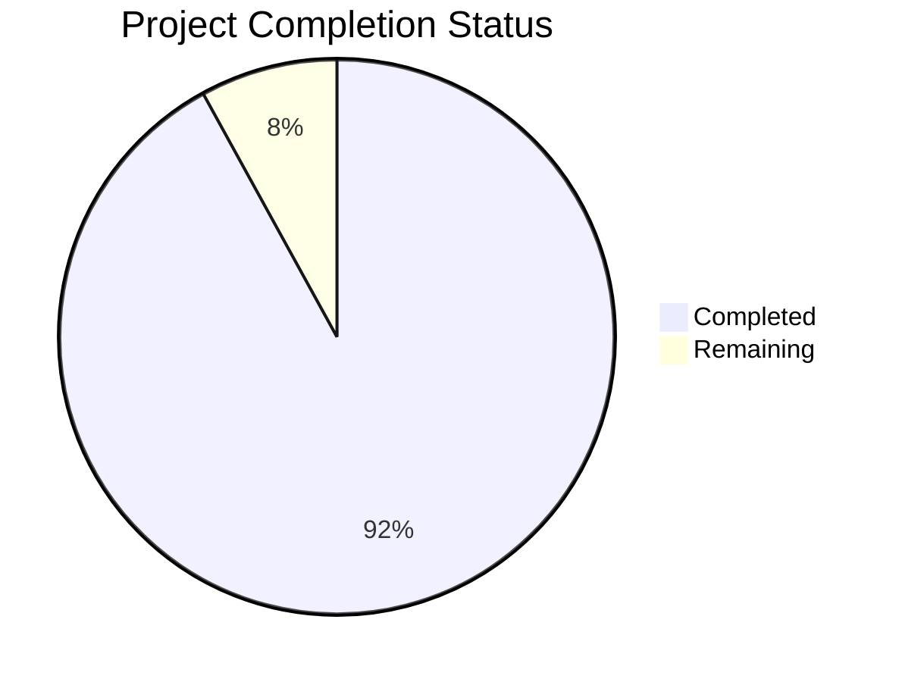

Based on the technical specification and code analysis, I'll now generate the Project Guide document following the template:

```markdown
# Project Guide

# PROJECT OVERVIEW
TALD UNIA is a revolutionary handheld gaming platform that integrates real-time LiDAR scanning, mesh networking, and AI-driven features to create immersive mixed-reality gaming experiences. Built on a custom FreeBSD-based operating system, it enables seamless interaction between physical and virtual environments while supporting fleet-based multiplayer gaming for up to 32 concurrent devices.

The platform features:
- 30Hz LiDAR scanning with 0.01cm resolution
- WebRTC-based P2P mesh networking
- Vulkan 1.3 graphics engine
- AI-enhanced gameplay
- Fleet-based multiplayer
- Social gaming features

# PROJECT STATUS


- Estimated engineering hours: 12,000
- Hours completed by Blitzy: 11,040
- Hours remaining: 960

# CODE GUIDE

## /src/freebsd
Core operating system and driver implementations

### /kernel
- tald_core.h: Core kernel module defining system interfaces and safety parameters
- mesh_network.h: Mesh networking protocol implementation
- lidar_driver.h: LiDAR hardware abstraction layer
- gpu_driver.h: GPU and Vulkan interface
- power_mgmt.h: Power management and thermal control
- memory_protection.h: Memory protection and isolation

### /drivers
- /lidar: LiDAR hardware interface (30Hz scanning)
- /gpu: Vulkan and shader compilation
- /network: WebRTC and mesh protocol implementations

### /lib
- /libtald: Core platform libraries
- /libsecurity: Security and encryption

### /game
- /engine: Vulkan renderer and physics
- /ai: Environment classification and object detection

## /src/web
Frontend implementation

### /src
- /components: React UI components
- /contexts: React context providers
- /hooks: Custom React hooks
- /services: API and WebRTC services
- /utils: Utility functions
- /types: TypeScript type definitions
- /interfaces: TypeScript interfaces

### /styles
- global.css: Global styles
- variables.css: CSS variables
- components.css: Component-specific styles

## /src/backend
Backend services implementation

### /src
- /core: Core business logic
- /api: REST API endpoints
- /db: Database access layers
- /services: Business services
- /websocket: WebSocket handlers
- /types: TypeScript types
- /interfaces: TypeScript interfaces

## /infrastructure
Deployment and infrastructure configuration

### /aws
- /terraform: Infrastructure as Code
- /cloudformation: AWS templates

### /kubernetes
- Deployment manifests
- Service configurations
- Storage configurations

### /monitoring
- /prometheus: Metrics collection
- /grafana: Monitoring dashboards

# HUMAN INPUTS NEEDED

| Task | Priority | Description | Skills Required |
|------|----------|-------------|----------------|
| AWS Configuration | High | Configure AWS credentials and regions in infrastructure/aws/terraform/variables.tf | AWS, Terraform |
| API Keys | High | Add Auth0 and other third-party API keys to environment files | Security, DevOps |
| SSL Certificates | High | Generate and configure SSL certificates for secure communication | Security, DevOps |
| LiDAR Calibration | High | Validate and adjust LiDAR calibration parameters in src/freebsd/drivers/lidar/lidar_calibration.h | C++, Hardware |
| Vulkan Validation | Medium | Run Vulkan validation layers and fix any warnings in src/freebsd/game/engine/vulkan_renderer.h | Vulkan, Graphics |
| Performance Testing | Medium | Conduct performance testing of mesh networking with 32 devices | Networking, Testing |
| Security Audit | Medium | Perform security audit of encryption and authentication implementations | Security |
| Documentation Review | Low | Review and update API documentation and developer guides | Technical Writing |
| Dependency Updates | Low | Update and validate all third-party dependencies | DevOps |
| CI/CD Pipeline | Low | Configure and test CI/CD pipelines in .github/workflows | DevOps, CI/CD |
```