# Technical Specifications

# 1. INTRODUCTION

## 1.1 Executive Summary

TALD UNIA is a revolutionary handheld gaming platform that integrates real-time LiDAR scanning, mesh networking, and AI-driven features to create immersive mixed-reality gaming experiences. Built on a custom FreeBSD-based operating system, the platform enables seamless interaction between physical and virtual environments while supporting fleet-based multiplayer gaming for up to 32 concurrent devices. The system addresses the growing demand for social, location-aware gaming experiences while providing a robust platform for both entertainment and institutional applications.

Key stakeholders include gaming enthusiasts, social gamers, game developers, enterprise clients, and institutional users such as museums and entertainment venues. The platform's unique combination of environmental scanning, low-latency networking, and AI capabilities positions it to capture significant market share in the emerging mixed-reality gaming segment.

## 1.2 System Overview

### Project Context

| Aspect | Description |
| --- | --- |
| Market Position | First-to-market handheld gaming platform with integrated LiDAR and mesh networking capabilities |
| Target Market | Gaming enthusiasts, social gamers, enterprise/institutional users |
| Competitive Advantage | Real-time environmental scanning, fleet-based multiplayer, AI-driven experiences |
| Integration Landscape | Cloud services (AWS), content delivery networks, authentication providers |

### High-Level Description

The TALD UNIA platform comprises four core technical components:

1. LiDAR Processing Pipeline

- 30Hz continuous scanning
- 0.01cm resolution
- 5-meter effective range
- Real-time point cloud processing

2. Mesh Networking Infrastructure

- 32-device fleet support
- WebRTC-based P2P communication
- \<50ms network latency
- CRDT-based state synchronization

3. Game Engine

- Vulkan 1.3-based rendering
- Edge computing optimization
- Real-time physics simulation
- Environment mesh integration

4. Social Platform

- Proximity-based discovery
- Fleet formation/management
- Environment sharing
- Real-time communication

### Success Criteria

| Metric | Target |
| --- | --- |
| Scan Processing Latency | ≤50ms at 30Hz |
| Network Latency | ≤50ms P2P |
| Frame Rate | ≥60 FPS |
| Fleet Size | 32 devices |
| Battery Life | ≥4 hours |
| User Satisfaction | ≥4.5/5 rating |

## 1.3 Scope

### In-Scope Elements

Core Features:

- Real-time LiDAR environmental scanning
- Mesh network-based multiplayer gaming
- AI-enhanced gameplay and interactions
- Social gaming platform features
- Development tools and SDKs

Implementation Boundaries:

- Consumer gaming market
- Enterprise/institutional deployments
- North American and European markets
- Gaming and social interaction data domains

### Out-of-Scope Elements

- General-purpose computing functionality
- Non-gaming applications
- Third-party operating system support
- Direct hardware modifications
- Cellular network connectivity
- Cloud gaming streaming
- Virtual reality features
- Legacy game compatibility

Future Considerations:

- Asian market expansion
- Educational platform features
- Healthcare applications
- Extended reality integration
- Temporal.io Integration for complexity management across redundancy in workload orchestration 

# 2. SYSTEM ARCHITECTURE

## 2.1 High-Level Architecture

The TALD UNIA platform follows a hybrid architecture combining edge computing for real-time processing with distributed systems for fleet coordination and cloud services for data persistence.

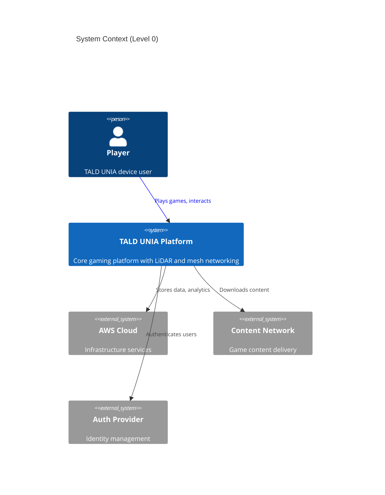
```mermaid
C4Context
    title System Context (Level 0)
    
    Person(player, "Player", "TALD UNIA device user")
    System(taldUnia, "TALD UNIA Platform", "Core gaming platform with LiDAR and mesh networking")
    
    System_Ext(aws, "AWS Cloud", "Infrastructure services")
    System_Ext(cdn, "Content Network", "Game content delivery")
    System_Ext(auth, "Auth Provider", "Identity management")
    
    Rel(player, taldUnia, "Plays games, interacts")
    Rel(taldUnia, aws, "Stores data, analytics")
    Rel(taldUnia, cdn, "Downloads content")
    Rel(taldUnia, auth, "Authenticates users")
    
    UpdateRelStyle(player, taldUnia, $textColor="blue", $lineColor="blue")
```

### Container Architecture (Level 1)

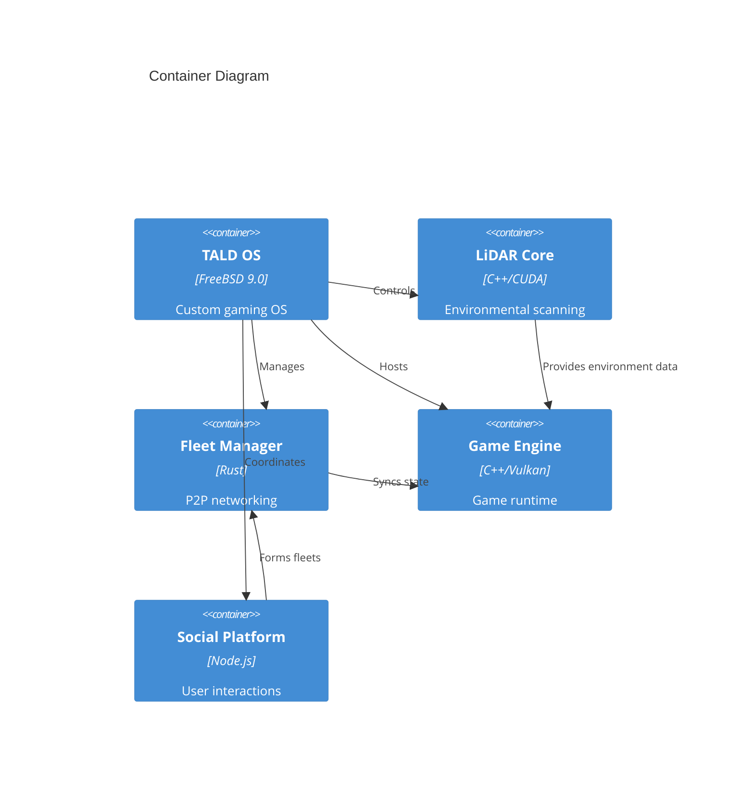
```mermaid
C4Container
    title Container Diagram
    
    Container(os, "TALD OS", "FreeBSD 9.0", "Custom gaming OS")
    Container(lidar, "LiDAR Core", "C++/CUDA", "Environmental scanning")
    Container(mesh, "Fleet Manager", "Rust", "P2P networking")
    Container(game, "Game Engine", "C++/Vulkan", "Game runtime")
    Container(social, "Social Platform", "Node.js", "User interactions")
    
    Rel(os, lidar, "Controls")
    Rel(os, mesh, "Manages")
    Rel(os, game, "Hosts")
    Rel(os, social, "Coordinates")
    
    Rel(lidar, game, "Provides environment data")
    Rel(mesh, game, "Syncs state")
    Rel(social, mesh, "Forms fleets")
```

## 2.2 Component Details

### LiDAR Processing Pipeline

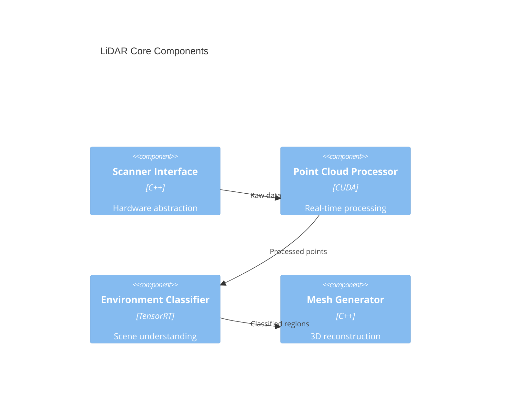
```mermaid
C4Component
    title LiDAR Core Components
    
    Component(scanner, "Scanner Interface", "C++", "Hardware abstraction")
    Component(processor, "Point Cloud Processor", "CUDA", "Real-time processing")
    Component(classifier, "Environment Classifier", "TensorRT", "Scene understanding")
    Component(mesh, "Mesh Generator", "C++", "3D reconstruction")
    
    Rel(scanner, processor, "Raw data")
    Rel(processor, classifier, "Processed points")
    Rel(classifier, mesh, "Classified regions")
```

| Component | Technology | Purpose | Scaling |
| --- | --- | --- | --- |
| Scanner Interface | C++20 | Hardware abstraction | Per device |
| Point Cloud Processor | CUDA 12.0 | Real-time processing | GPU parallel |
| Environment Classifier | TensorRT 8.6 | Scene understanding | Batch processing |
| Mesh Generator | C++20 | 3D reconstruction | Multi-threaded |

### Fleet Management System

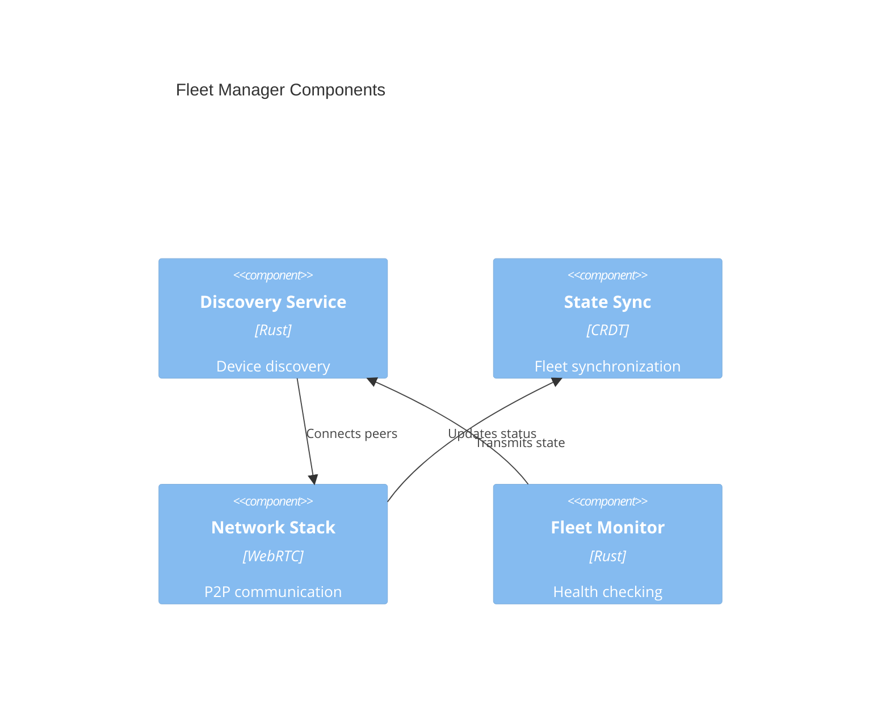
```mermaid
C4Component
    title Fleet Manager Components
    
    Component(discovery, "Discovery Service", "Rust", "Device discovery")
    Component(sync, "State Sync", "CRDT", "Fleet synchronization")
    Component(network, "Network Stack", "WebRTC", "P2P communication")
    Component(monitor, "Fleet Monitor", "Rust", "Health checking")
    
    Rel(discovery, network, "Connects peers")
    Rel(network, sync, "Transmits state")
    Rel(monitor, discovery, "Updates status")
```

## 2.3 Technical Decisions

### Architecture Style Justification

| Aspect | Choice | Rationale |
| --- | --- | --- |
| Core Architecture | Hybrid Edge/Distributed | Optimizes for low latency and fleet coordination |
| Communication | Event-driven + P2P | Enables real-time gaming with minimal infrastructure |
| Data Storage | Multi-tier | Balances performance and persistence needs |
| State Management | CRDT-based | Ensures consistency across fleet devices |

### Data Flow Architecture

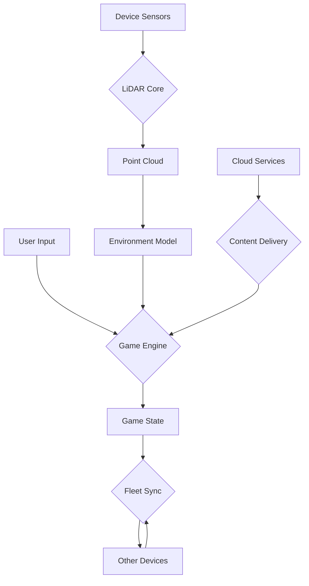
```mermaid
flowchart TD
    A[Device Sensors] --> B{LiDAR Core}
    B --> C[Point Cloud]
    C --> D[Environment Model]
    
    E[User Input] --> F{Game Engine}
    D --> F
    F --> G[Game State]
    
    G --> H{Fleet Sync}
    H --> I[Other Devices]
    I --> H
    
    J[Cloud Services] --> K{Content Delivery}
    K --> F
```

## 2.4 Cross-Cutting Concerns

### Monitoring Architecture

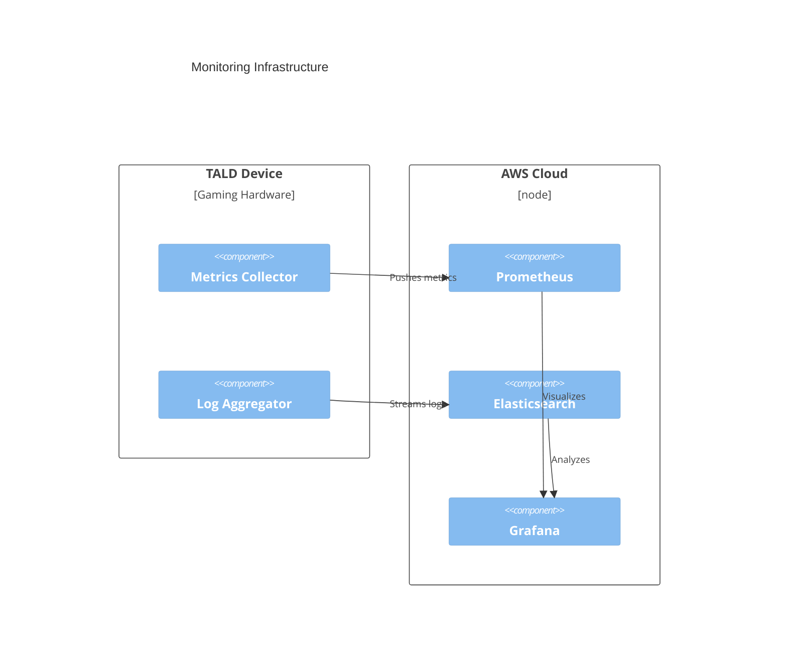
```mermaid
C4Deployment
    title Monitoring Infrastructure
    
    Node(device, "TALD Device", "Gaming Hardware") {
        Component(metrics, "Metrics Collector")
        Component(logs, "Log Aggregator")
    }
    
    Node(cloud, "AWS Cloud") {
        Component(prometheus, "Prometheus")
        Component(elastic, "Elasticsearch")
        Component(grafana, "Grafana")
    }
    
    Rel(metrics, prometheus, "Pushes metrics")
    Rel(logs, elastic, "Streams logs")
    Rel(prometheus, grafana, "Visualizes")
    Rel(elastic, grafana, "Analyzes")
```

### Security Architecture

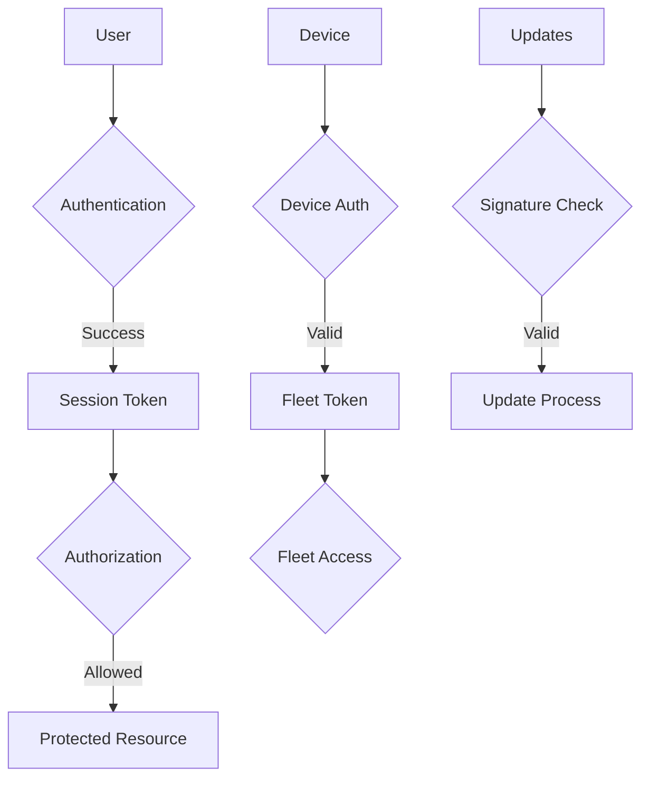
```mermaid
flowchart TD
    A[User] --> B{Authentication}
    B --> |Success| C[Session Token]
    C --> D{Authorization}
    D --> |Allowed| E[Protected Resource]
    
    F[Device] --> G{Device Auth}
    G --> |Valid| H[Fleet Token]
    H --> I{Fleet Access}
    
    J[Updates] --> K{Signature Check}
    K --> |Valid| L[Update Process]
```

## 2.5 Deployment Architecture

```mermaid
C4Deployment
    title Physical Deployment
    
    Node(device, "TALD Device") {
        Container(os, "TALD OS")
        Container(services, "Core Services")
    }
    
    Node(aws, "AWS Cloud") {
        Container(storage, "S3/DynamoDB")
        Container(compute, "ECS/Lambda")
    }
    
    Node(cdn, "CDN Edge") {
        Container(cache, "Content Cache")
    }
    
    Rel(device, aws, "HTTPS")
    Rel(device, cdn, "HTTPS")
    Rel(device, device, "WebRTC")
```

# 3. SYSTEM COMPONENTS ARCHITECTURE

## 3.1 User Interface Design

### 3.1.1 Design System Specifications

| Component | Specification | Requirements |
| --- | --- | --- |
| Typography | Custom Gaming Font | - Variable weight support<br>- Bitmap optimization<br>- Multi-language compatibility |
| Color System | HDR-aware Palette | - 10-bit color depth<br>- P3 color gamut<br>- Dynamic contrast adaptation |
| Layout Grid | 8px Base Unit | - 16:9 and 21:9 support<br>- Dynamic scaling<br>- Safe zone compliance |
| Motion Design | 60 FPS Animations | - GPU-accelerated<br>- Power-aware scaling<br>- Sub-16ms transitions |

### 3.1.2 Interface Hierarchy

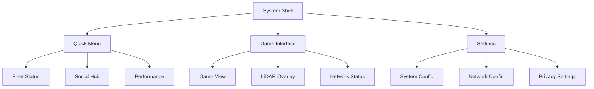
```mermaid
flowchart TD
    A[System Shell] --> B[Quick Menu]
    A --> C[Game Interface]
    A --> D[Settings]
    
    B --> E[Fleet Status]
    B --> F[Social Hub]
    B --> G[Performance]
    
    C --> H[Game View]
    C --> I[LiDAR Overlay]
    C --> J[Network Status]
    
    D --> K[System Config]
    D --> L[Network Config]
    D --> M[Privacy Settings]
```

### 3.1.3 Critical User Flows

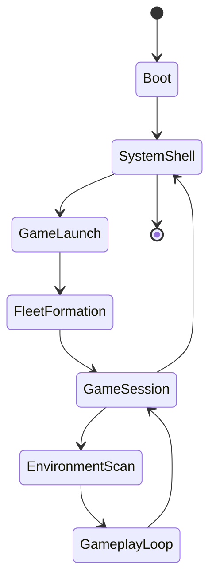
```mermaid
stateDiagram-v2
    [*] --> Boot
    Boot --> SystemShell
    SystemShell --> GameLaunch
    GameLaunch --> FleetFormation
    FleetFormation --> GameSession
    GameSession --> EnvironmentScan
    EnvironmentScan --> GameplayLoop
    GameplayLoop --> GameSession
    GameSession --> SystemShell
    SystemShell --> [*]
```

## 3.2 Database Design

### 3.2.1 Core Schema

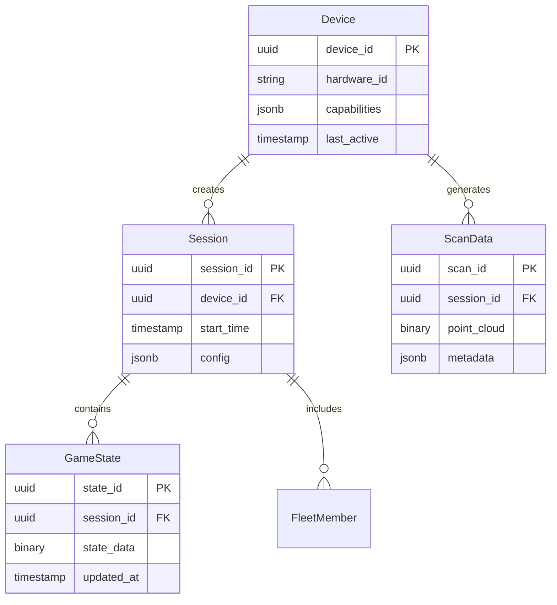
```mermaid
erDiagram
    Device ||--o{ Session : creates
    Device ||--o{ ScanData : generates
    Session ||--o{ GameState : contains
    Session ||--o{ FleetMember : includes
    
    Device {
        uuid device_id PK
        string hardware_id
        jsonb capabilities
        timestamp last_active
    }
    
    Session {
        uuid session_id PK
        uuid device_id FK
        timestamp start_time
        jsonb config
    }
    
    ScanData {
        uuid scan_id PK
        uuid session_id FK
        binary point_cloud
        jsonb metadata
    }
    
    GameState {
        uuid state_id PK
        uuid session_id FK
        binary state_data
        timestamp updated_at
    }
```

### 3.2.2 Data Management Strategy

| Aspect | Implementation | Details |
| --- | --- | --- |
| Partitioning | Time-based | - Monthly scan data partitions<br>- Weekly session partitions |
| Replication | Multi-region | - Active-active configuration<br>- 3 region minimum |
| Caching | Redis Cluster | - 15-minute session cache<br>- 1-hour scan cache |
| Backup | Continuous | - Point-in-time recovery<br>- Cross-region replication |

## 3.3 API Design

### 3.3.1 Fleet Management API

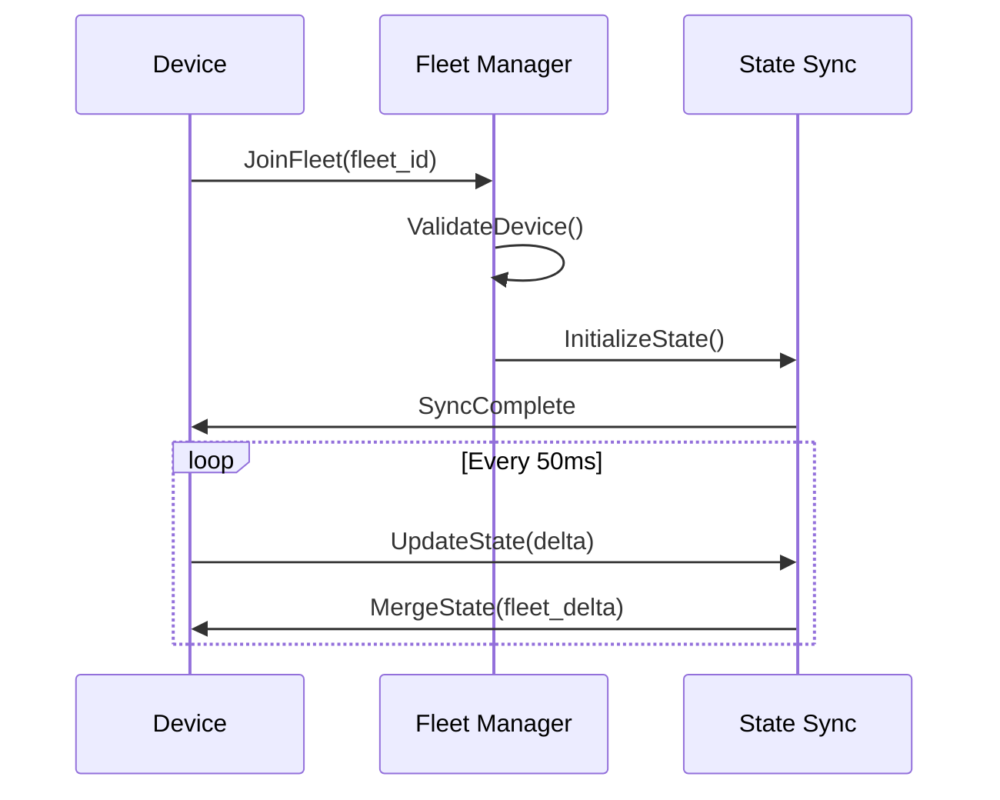
```mermaid
sequenceDiagram
    participant D as Device
    participant F as Fleet Manager
    participant S as State Sync
    
    D->>F: JoinFleet(fleet_id)
    F->>F: ValidateDevice()
    F->>S: InitializeState()
    S->>D: SyncComplete
    
    loop Every 50ms
        D->>S: UpdateState(delta)
        S->>D: MergeState(fleet_delta)
    end
```

### 3.3.2 API Specifications

| Endpoint | Method | Purpose | Rate Limit |
| --- | --- | --- | --- |
| /fleet/join | POST | Join fleet | 10/min |
| /fleet/sync | WebSocket | State sync | 20/sec |
| /scan/upload | PUT | Upload scan | 30/sec |
| /session/create | POST | Create session | 5/min |

### 3.3.3 Integration Patterns

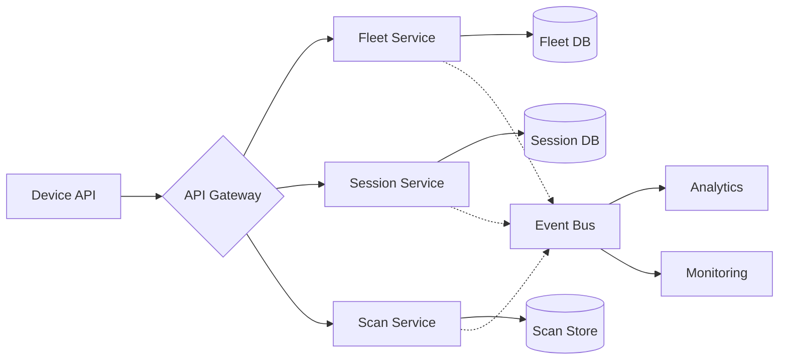
```mermaid
flowchart LR
    A[Device API] --> B{API Gateway}
    B --> C[Fleet Service]
    B --> D[Session Service]
    B --> E[Scan Service]
    
    C --> F[(Fleet DB)]
    D --> G[(Session DB)]
    E --> H[(Scan Store)]
    
    C -.-> I[Event Bus]
    D -.-> I
    E -.-> I
    
    I --> J[Analytics]
    I --> K[Monitoring]
```

### 3.3.4 Security Controls

| Control | Implementation | Requirements |
| --- | --- | --- |
| Authentication | OAuth 2.0 + JWT | - 15-minute token expiry<br>- Hardware-backed keys |
| Authorization | RBAC | - Fleet-level permissions<br>- Device capabilities |
| Encryption | TLS 1.3 | - Certificate pinning<br>- Perfect forward secrecy |
| Rate Limiting | Token Bucket | - Per-device limits<br>- Burst allowance |

# 4. TECHNOLOGY STACK

## 4.1 PROGRAMMING LANGUAGES

| Component | Language | Version | Justification |
| --- | --- | --- | --- |
| LiDAR Core | C++20 | GCC 12.0 | - Zero-overhead abstractions<br>- Direct hardware access<br>- CUDA integration support |
| Fleet Manager | Rust | 1.70+ | - Memory safety guarantees<br>- Zero-cost abstractions<br>- Excellent concurrency model |
| Game Engine | C++20 | GCC 12.0 | - Vulkan API compatibility<br>- Performance optimization<br>- Low-level control |
| Social Platform | Node.js | 18 LTS | - Event-driven architecture<br>- Rich ecosystem<br>- WebSocket support |
| System Services | FreeBSD C | 9.0 | - Kernel module development<br>- System call integration<br>- Driver compatibility |

## 4.2 FRAMEWORKS & LIBRARIES

### Core Frameworks

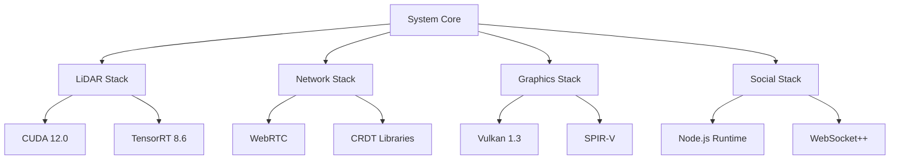
```mermaid
flowchart TD
    A[System Core] --> B[LiDAR Stack]
    A --> C[Network Stack]
    A --> D[Graphics Stack]
    A --> E[Social Stack]
    
    B --> F[CUDA 12.0]
    B --> G[TensorRT 8.6]
    
    C --> H[WebRTC]
    C --> I[CRDT Libraries]
    
    D --> J[Vulkan 1.3]
    D --> K[SPIR-V]
    
    E --> L[Node.js Runtime]
    E --> M[WebSocket++]
```

| Framework | Version | Purpose | Justification |
| --- | --- | --- | --- |
| CUDA | 12.0 | LiDAR processing | - GPU acceleration<br>- Optimized point cloud processing |
| TensorRT | 8.6 | AI inference | - Low-latency inference<br>- GPU optimization |
| WebRTC | M98 | P2P networking | - Standardized P2P protocol<br>- NAT traversal |
| Vulkan | 1.3 | Graphics rendering | - Low-level GPU control<br>- Cross-platform support |
| Automerge | 2.0 | CRDT implementation | - Proven conflict resolution<br>- Active maintenance |

## 4.3 DATABASES & STORAGE

### Storage Architecture

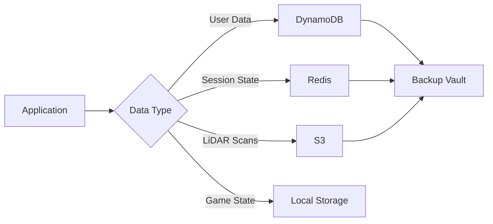
```mermaid
flowchart LR
    A[Application] --> B{Data Type}
    
    B -->|User Data| C[DynamoDB]
    B -->|Session State| D[Redis]
    B -->|LiDAR Scans| E[S3]
    B -->|Game State| F[Local Storage]
    
    C --> G[Backup Vault]
    D --> G
    E --> G
```

| Storage Type | Technology | Purpose | Configuration |
| --- | --- | --- | --- |
| Primary DB | DynamoDB | User/profile data | - Multi-region deployment<br>- Auto-scaling enabled |
| Cache | Redis Cluster | Session/state data | - In-memory replication<br>- 15-minute TTL |
| Object Storage | S3 | LiDAR scan data | - Cross-region replication<br>- Lifecycle policies |
| Local Storage | Custom FS | Game state/assets | - Custom FreeBSD filesystem<br>- Journaling enabled |

## 4.4 THIRD-PARTY SERVICES

### Service Dependencies

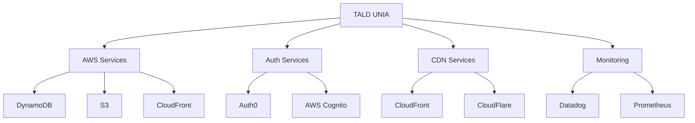
```mermaid
flowchart TD
    A[TALD UNIA] --> B[AWS Services]
    A --> C[Auth Services]
    A --> D[CDN Services]
    A --> E[Monitoring]
    
    B --> F[DynamoDB]
    B --> G[S3]
    B --> H[CloudFront]
    
    C --> I[Auth0]
    C --> J[AWS Cognito]
    
    D --> K[CloudFront]
    D --> L[CloudFlare]
    
    E --> M[Datadog]
    E --> N[Prometheus]
```

| Service | Provider | Purpose | Integration |
| --- | --- | --- | --- |
| Authentication | Auth0 | Identity management | - OAuth 2.0/OIDC<br>- MFA support |
| CDN | CloudFront | Content delivery | - Global edge network<br>- HTTPS enforcement |
| Monitoring | Datadog | System monitoring | - Custom metrics<br>- APM integration |
| Analytics | AWS Kinesis | Usage analytics | - Real-time processing<br>- Data warehousing |

## 4.5 DEVELOPMENT & DEPLOYMENT

### Development Pipeline

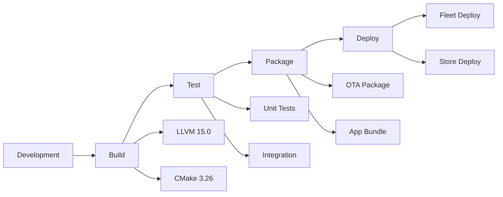
```mermaid
flowchart LR
    A[Development] --> B[Build]
    B --> C[Test]
    C --> D[Package]
    D --> E[Deploy]
    
    B --> F[LLVM 15.0]
    B --> G[CMake 3.26]
    
    C --> H[Unit Tests]
    C --> I[Integration]
    
    D --> J[OTA Package]
    D --> K[App Bundle]
    
    E --> L[Fleet Deploy]
    E --> M[Store Deploy]
```

| Category | Tool | Version | Purpose |
| --- | --- | --- | --- |
| Build System | CMake | 3.26 | - Cross-platform builds<br>- Dependency management |
| Compiler | LLVM/Clang | 15.0 | - Modern C++ support<br>- Cross-compilation |
| Containerization | Docker | 24.0 | - Development environments<br>- Service packaging |
| CI/CD | Jenkins | 2.414 | - Automated builds<br>- Deployment automation |

# 5. SYSTEM DESIGN

## 5.1 User Interface Design

### 5.1.1 Core Interface Layout

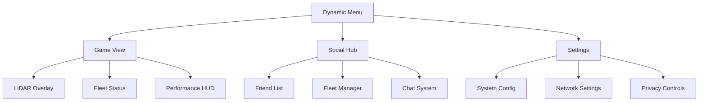
```mermaid
flowchart TD
    A[Dynamic Menu] --> B[Game View]
    A --> C[Social Hub]
    A --> D[Settings]
    
    B --> E[LiDAR Overlay]
    B --> F[Fleet Status]
    B --> G[Performance HUD]
    
    C --> H[Friend List]
    C --> I[Fleet Manager]
    C --> J[Chat System]
    
    D --> K[System Config]
    D --> L[Network Settings]
    D --> M[Privacy Controls]
```

### 5.1.2 Interface Components

| Component | Description | Technical Requirements |
| --- | --- | --- |
| Dynamic Menu | Main navigation interface | - 60 FPS animations<br>- GPU-accelerated transitions<br>- Context-sensitive layout |
| Game View | Primary gameplay screen | - Vulkan rendering pipeline<br>- LiDAR data visualization<br>- Real-time mesh updates |
| Social Hub | Social interaction center | - Real-time status updates<br>- WebRTC signaling<br>- Proximity indicators |
| Fleet Manager | Device coordination UI | - Live fleet status<br>- Network quality metrics<br>- Position mapping |

## 5.2 Database Design

### 5.2.1 Core Schema

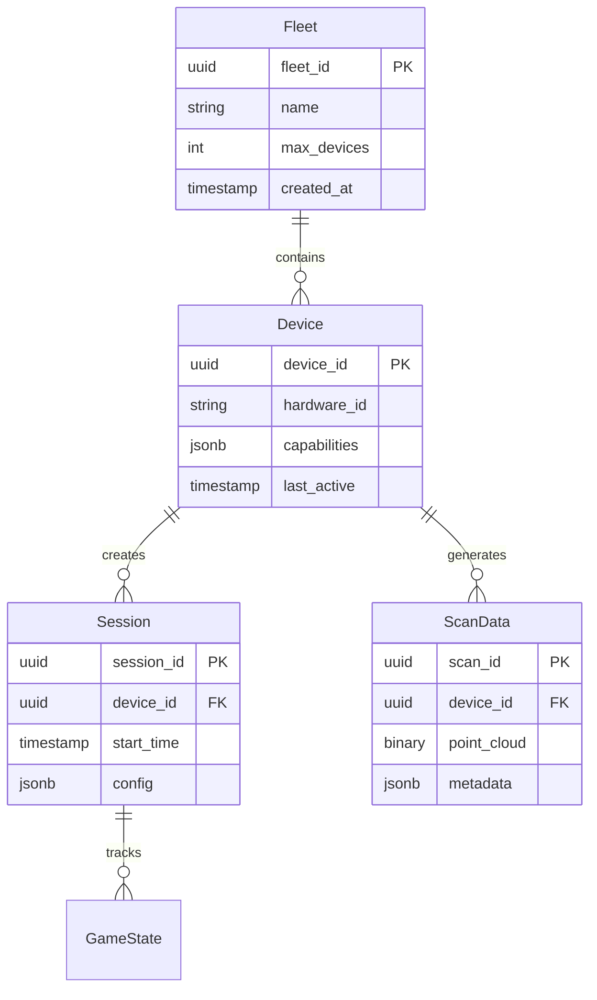
```mermaid
erDiagram
    Device ||--o{ Session : creates
    Device ||--o{ ScanData : generates
    Fleet ||--o{ Device : contains
    Session ||--o{ GameState : tracks
    
    Device {
        uuid device_id PK
        string hardware_id
        jsonb capabilities
        timestamp last_active
    }
    
    Fleet {
        uuid fleet_id PK
        string name
        int max_devices
        timestamp created_at
    }
    
    Session {
        uuid session_id PK
        uuid device_id FK
        timestamp start_time
        jsonb config
    }
    
    ScanData {
        uuid scan_id PK
        uuid device_id FK
        binary point_cloud
        jsonb metadata
    }
```

### 5.2.2 Storage Strategy

| Data Type | Storage Solution | Configuration |
| --- | --- | --- |
| User Data | DynamoDB | - Multi-region deployment<br>- Auto-scaling enabled<br>- Point-in-time recovery |
| Session State | Redis Cluster | - In-memory replication<br>- 15-minute TTL<br>- Automatic failover |
| LiDAR Data | S3 + Local Cache | - Cross-region replication<br>- Lifecycle policies<br>- Versioning enabled |
| Game State | Custom FS | - FreeBSD filesystem<br>- Journaling enabled<br>- Atomic operations |

## 5.3 API Design

### 5.3.1 Core API Architecture

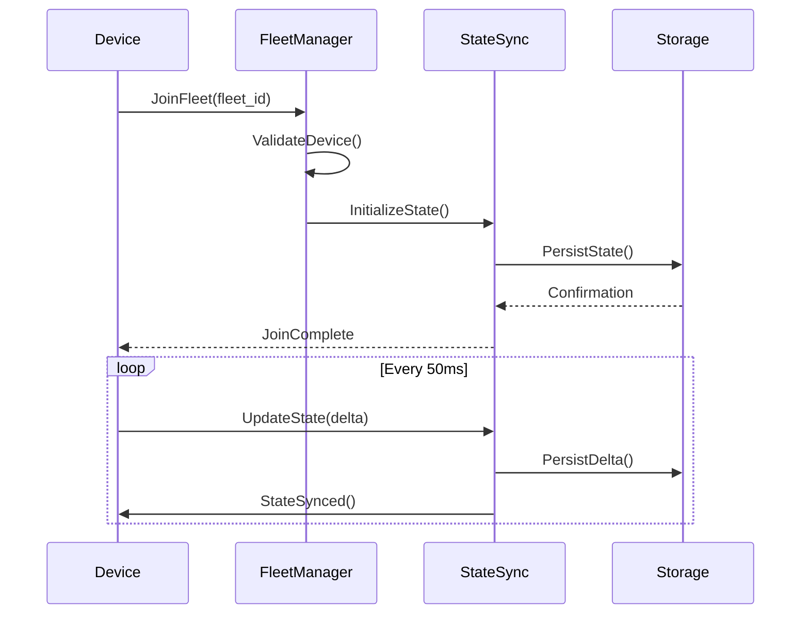
```mermaid
sequenceDiagram
    participant Device
    participant FleetManager
    participant StateSync
    participant Storage
    
    Device->>FleetManager: JoinFleet(fleet_id)
    FleetManager->>FleetManager: ValidateDevice()
    FleetManager->>StateSync: InitializeState()
    StateSync->>Storage: PersistState()
    Storage-->>StateSync: Confirmation
    StateSync-->>Device: JoinComplete
    
    loop Every 50ms
        Device->>StateSync: UpdateState(delta)
        StateSync->>Storage: PersistDelta()
        StateSync->>Device: StateSynced()
    end
```

### 5.3.2 API Endpoints

| Endpoint | Method | Purpose | Rate Limit |
| --- | --- | --- | --- |
| /fleet/join | POST | Join device fleet | 10/min |
| /fleet/sync | WebSocket | State synchronization | 20/sec |
| /scan/upload | PUT | Upload LiDAR data | 30/sec |
| /session/create | POST | Create game session | 5/min |

### 5.3.3 Data Flow Architecture

```mermaid
flowchart LR
    A[Device API] --> B{API Gateway}
    B --> C[Fleet Service]
    B --> D[Session Service]
    B --> E[Scan Service]
    
    C --> F[(Fleet DB)]
    D --> G[(Session DB)]
    E --> H[(Scan Store)]
    
    C -.-> I[Event Bus]
    D -.-> I
    E -.-> I
    
    I --> J[Analytics]
    I --> K[Monitoring]
```

## 5.4 Security Architecture

### 5.4.1 Authentication Flow

```mermaid
flowchart TD
    A[Device] --> B{Auth Request}
    B --> C[OAuth 2.0]
    C --> D{Validate}
    
    D -->|Success| E[JWT Token]
    D -->|Failure| F[Error]
    
    E --> G[Session]
    G --> H[Access Control]
    
    H --> I[Resources]
    H --> J[Fleet]
    H --> K[Storage]
```

### 5.4.2 Security Controls

| Control | Implementation | Requirements |
| --- | --- | --- |
| Authentication | OAuth 2.0 + JWT | - Hardware-backed keys<br>- Token rotation<br>- MFA support |
| Authorization | RBAC | - Fleet-level permissions<br>- Resource scoping<br>- Audit logging |
| Encryption | TLS 1.3 | - Perfect forward secrecy<br>- Certificate pinning<br>- Key rotation |
| Data Protection | AES-256-GCM | - Hardware acceleration<br>- Secure key storage<br>- Memory protection |

# 6. USER INTERFACE DESIGN

## 6.1 Overview

The TALD UNIA platform requires a specialized gaming UI optimized for handheld operation and real-time LiDAR integration. The interface follows a minimalist design philosophy while providing quick access to core gaming and social features.

## 6.2 UI Component Key

```
Icons:
[#] Main Menu/Dashboard    [@] User Profile      [!] Alert/Warning
[?] Help/Tutorial         [$] Store/Payment     [i] Information  
[+] Add/Create           [x] Close/Exit        [<][>] Navigation
[^] Upload/Share         [=] Settings          [*] Favorite

Interactive Elements:
[ ] Checkbox             (...) Text Input      [Button] Action Button
( ) Radio Button         [v] Dropdown          [====] Progress Bar

Layout Elements:
+--+ Border Box          |  | Container        --- Separator
>>> Flow Direction       ... Loading           /** Comments **/
```

## 6.3 Main Menu Interface

```
+----------------------------------------------------------+
|  TALD UNIA                                    [@] [?] [=] |
+----------------------------------------------------------+
|                                                           |
|     +------------------+  +------------------+            |
|     |    [#] PLAY     |  |    [$] STORE    |            |
|     +------------------+  +------------------+            |
|                                                          |
|     +------------------+  +------------------+            |
|     |    [@] SOCIAL   |  |  [=] SETTINGS   |            |
|     +------------------+  +------------------+            |
|                                                          |
|  [!] Fleet Status: 3/32 Connected                        |
|  [i] LiDAR Status: Active (30Hz)                         |
|                                                          |
+----------------------------------------------------------+
|  Battery: [====----] 60%    Network: [===-----] 45ms     |
+----------------------------------------------------------+
```

## 6.4 Game View Interface

```
+----------------------------------------------------------+
| [x] Exit  Game Title                    FPS: 60  Ping: 45ms|
+----------------------------------------------------------+
|                                                           |
|                   Main Game Viewport                      |
|                                                          |
|                                                          |
|                                                          |
|                                                          |
|              [i] LiDAR Overlay Active                    |
|                                                          |
|                                                          |
+---------------------------+------------------------------+
|                          |                              |
| Fleet Members:           | Environment Data:            |
| [@] Player1 (Host)       | - Scan Quality: 95%          |
| [@] Player2             | - Points: 1.2M               |
| [@] Player3             | - Range: 4.8m                |
+---------------------------+------------------------------+
```

## 6.5 Social Hub Interface

```
+----------------------------------------------------------+
|  Social Hub                                    [x] Close  |
+----------------------------------------------------------+
|  [+] Create Fleet            Active Players Nearby: 5     |
|----------------------------------------------------------
|                                                          |
|  Nearby Players:                                         |
|  +-- [@] Player1    [*]   (2m away)  [Join Fleet]       |
|  +-- [@] Player2          (3m away)  [Join Fleet]       |
|  +-- [@] Player3    [*]   (4m away)  [Join Fleet]       |
|                                                          |
|  Your Fleet:                                            |
|  +-- [@] YourName (Leader)                              |
|  +-- [@] Member1   [x]                                  |
|  +-- [@] Member2   [x]                                  |
|                                                          |
|  Fleet Settings:                                         |
|  [ ] Public Fleet                                        |
|  [ ] Allow Join Requests                                 |
|  [v] Max Players: 32                                     |
|                                                          |
+----------------------------------------------------------+
```

## 6.6 Settings Panel

```
+----------------------------------------------------------+
|  Settings                                      [x] Close  |
+----------------------------------------------------------+
|  Categories:                                              |
|  +-- Graphics                                            |
|      ( ) Performance Mode                                |
|      ( ) Quality Mode                                    |
|      ( ) Custom                                          |
|          [v] Resolution: 1920x1080                       |
|          [====----] LiDAR Quality: 60%                   |
|                                                          |
|  +-- Network                                             |
|      [ ] Auto-Join Nearby Fleets                         |
|      [ ] Share Environment Data                          |
|      [v] Region: Auto                                    |
|                                                          |
|  +-- Privacy                                             |
|      [ ] Show Online Status                              |
|      [ ] Share Play History                              |
|      [ ] Allow Friend Requests                           |
|                                                          |
|  [Save Changes]                [Restore Defaults]         |
+----------------------------------------------------------+
```

## 6.7 Navigation Flow

```mermaid
flowchart TD
    A[Main Menu] --> B[Play]
    A --> C[Store]
    A --> D[Social Hub]
    A --> E[Settings]
    
    B --> F[Game View]
    F --> G[Pause Menu]
    G --> F
    G --> A
    
    D --> H[Fleet Creation]
    D --> I[Friend Management]
    
    E --> J[Graphics Settings]
    E --> K[Network Settings]
    E --> L[Privacy Settings]
```

## 6.8 UI Technical Requirements

| Component | Requirement | Implementation |
| --- | --- | --- |
| Main Menu | 60 FPS animations | GPU-accelerated transitions |
| Game View | Real-time LiDAR overlay | Vulkan compute shaders |
| Social Hub | 10Hz position updates | WebRTC data channels |
| Settings | Instant apply | Async configuration |
| Navigation | \<16ms input latency | Event-driven architecture |

# 7. SECURITY CONSIDERATIONS

## 7.1 AUTHENTICATION AND AUTHORIZATION

### 7.1.1 Authentication Flow

```mermaid
sequenceDiagram
    participant User
    participant Device
    participant AuthService
    participant TokenService
    participant Fleet
    
    User->>Device: Launch Application
    Device->>AuthService: Request Authentication
    AuthService->>Device: Present Auth Methods
    
    alt Hardware Token
        Device->>AuthService: Submit Hardware ID
        AuthService->>TokenService: Validate Hardware
    else OAuth 2.0
        Device->>AuthService: OAuth Flow
        AuthService->>TokenService: Generate Tokens
    end
    
    TokenService->>Device: Issue JWT + Refresh Token
    Device->>Fleet: Join with JWT
    Fleet->>Device: Confirm Access
```

### 7.1.2 Authorization Matrix

| Role | LiDAR Access | Fleet Management | Game Data | System Settings |
| --- | --- | --- | --- | --- |
| User | Read Own | Join Fleet | Read/Write Own | Read Own |
| Fleet Leader | Read Fleet | Manage Fleet | Read/Write Fleet | Read Own |
| Developer | Read/Write | Create Fleet | Read/Write All | Read/Write Limited |
| Admin | Full Access | Full Access | Full Access | Full Access |

## 7.2 DATA SECURITY

### 7.2.1 Encryption Standards

| Data Type | At Rest | In Transit | Key Management |
| --- | --- | --- | --- |
| User Credentials | AES-256-GCM | TLS 1.3 | AWS KMS |
| Game State | AES-256-GCM | DTLS 1.3 | Hardware TPM |
| LiDAR Data | AES-256-CTR | Custom Protocol | Local Key Store |
| Fleet Communication | N/A | WebRTC (DTLS) | P2P Exchange |

### 7.2.2 Data Protection Flow

```mermaid
flowchart TD
    A[Data Input] --> B{Classification}
    
    B -->|PII| C[Encryption Layer]
    B -->|Game Data| D[Compression]
    B -->|Telemetry| E[Anonymization]
    
    C --> F[Hardware Security]
    D --> G[Memory Protection]
    E --> H[Secure Storage]
    
    F --> I[Secure Enclave]
    G --> J[Protected Memory]
    H --> K[Encrypted Storage]
    
    I --> L[Access Control]
    J --> L
    K --> L
```

## 7.3 SECURITY PROTOCOLS

### 7.3.1 Network Security

```mermaid
flowchart LR
    A[Device] --> B{Security Layer}
    
    B --> C[TLS 1.3]
    B --> D[DTLS 1.3]
    B --> E[Custom P2P]
    
    C --> F[Cloud Services]
    D --> G[Fleet Communication]
    E --> H[LiDAR Exchange]
    
    F --> I[AWS Services]
    G --> J[Other Devices]
    H --> K[Local Processing]
```

### 7.3.2 Security Controls

| Control Type | Implementation | Monitoring |
| --- | --- | --- |
| Access Control | RBAC + JWT | Real-time audit logs |
| Network Security | TLS 1.3 + Certificate Pinning | Network traffic analysis |
| Memory Protection | ASLR + DEP | Runtime integrity checks |
| Hardware Security | TPM 2.0 + Secure Boot | Hardware attestation |
| Update Security | Signed OTA + Rollback Protection | Update verification |

### 7.3.3 Incident Response

```mermaid
stateDiagram-v2
    [*] --> Monitoring
    Monitoring --> Detection: Security Event
    Detection --> Analysis: Trigger Alert
    Analysis --> Response: Confirm Threat
    Response --> Mitigation: Execute Plan
    Mitigation --> Recovery: Threat Contained
    Recovery --> Monitoring: System Restored
    
    Analysis --> Monitoring: False Positive
```

### 7.3.4 Compliance Requirements

| Standard | Requirements | Implementation |
| --- | --- | --- |
| GDPR | Data Protection | - Data minimization<br>- Privacy by design<br>- User consent management |
| NIST 800-63 | Authentication | - MFA support<br>- Biometric options<br>- Secure key storage |
| ISO 27001 | Security Controls | - Risk assessment<br>- Security monitoring<br>- Incident response |
| COPPA | Child Protection | - Age verification<br>- Parental controls<br>- Data restrictions |

### 7.3.5 Security Monitoring

| Metric | Threshold | Action |
| --- | --- | --- |
| Failed Auth Attempts | \>5 in 5 minutes | Temporary account lock |
| Network Anomalies | \>2 standard deviations | Traffic analysis |
| System Integrity | Any modification | Immediate alert |
| Fleet Trust | Trust score \<80% | Remove from fleet |
| Update Status | \>7 days behind | Force update |

### 7.3.6 Secure Boot Process

```mermaid
sequenceDiagram
    participant Hardware
    participant UEFI
    participant Bootloader
    participant OS
    
    Hardware->>UEFI: Power On
    UEFI->>UEFI: Verify Hardware Trust
    UEFI->>Bootloader: Load Signed Bootloader
    Bootloader->>Bootloader: Verify Signature
    Bootloader->>OS: Load OS Image
    OS->>OS: Verify System Integrity
    OS->>OS: Initialize Security Services
```

# 8. INFRASTRUCTURE

## 8.1 DEPLOYMENT ENVIRONMENT

The TALD UNIA platform utilizes a hybrid deployment model combining edge computing on devices with cloud infrastructure for supporting services.

| Environment | Purpose | Components |
| --- | --- | --- |
| Edge (Device) | Core Gaming Functions | - LiDAR Processing Pipeline<br>- Game Engine<br>- Local Storage<br>- Mesh Network Node |
| Cloud | Supporting Services | - User Authentication<br>- Content Delivery<br>- Analytics<br>- Fleet Management |
| Hybrid Bridge | State Synchronization | - WebRTC Signaling<br>- State Persistence<br>- Fleet Coordination |

## 8.2 CLOUD SERVICES

AWS services are leveraged for scalability, reliability, and global reach:

```mermaid
flowchart TD
    A[TALD UNIA Platform] --> B{AWS Services}
    
    B --> C[Compute]
    B --> D[Storage]
    B --> E[Networking]
    B --> F[Security]
    
    C --> G[ECS Fargate]
    C --> H[Lambda]
    
    D --> I[S3]
    D --> J[DynamoDB]
    D --> K[ElastiCache]
    
    E --> L[CloudFront]
    E --> M[Route 53]
    
    F --> N[Cognito]
    F --> O[KMS]
```

| Service | Usage | Justification |
| --- | --- | --- |
| ECS Fargate | Fleet Management | Serverless container management for fleet coordination |
| Lambda | Event Processing | Serverless compute for event-driven operations |
| S3 | Content Storage | Scalable object storage for game assets and LiDAR data |
| DynamoDB | User Data | Low-latency NoSQL database for user profiles and states |
| ElastiCache | Session Cache | In-memory caching for real-time game sessions |
| CloudFront | Content Delivery | Global CDN for game content distribution |
| Cognito | Authentication | Managed authentication and user management |
| KMS | Key Management | Secure key storage and rotation |

## 8.3 CONTAINERIZATION

Docker containers are used for service isolation and consistent deployment:

```mermaid
flowchart LR
    A[Base Image] --> B[FreeBSD Base]
    B --> C[Core Services]
    C --> D[Game Services]
    
    E[Development] --> F[Build Container]
    F --> G[Test Container]
    G --> H[Production Container]
```

| Container | Purpose | Base Image |
| --- | --- | --- |
| Core Services | System Services | FreeBSD 9.0-slim |
| Fleet Manager | Network Coordination | Rust Alpine 1.70 |
| Game Server | Game State Management | Ubuntu 22.04 LTS |
| Analytics | Data Processing | Python 3.11-slim |

## 8.4 ORCHESTRATION

Kubernetes manages containerized services with high availability:

```mermaid
flowchart TD
    A[Kubernetes Cluster] --> B[Control Plane]
    A --> C[Worker Nodes]
    
    B --> D[API Server]
    B --> E[Scheduler]
    B --> F[Controller Manager]
    
    C --> G[Fleet Services]
    C --> H[Game Services]
    C --> I[Analytics]
```

| Component | Configuration | Scaling Policy |
| --- | --- | --- |
| Fleet Services | CPU: 2 cores<br>Memory: 4GB | Horizontal: 2-10 pods<br>CPU Threshold: 70% |
| Game Services | CPU: 4 cores<br>Memory: 8GB | Horizontal: 3-15 pods<br>Memory Threshold: 80% |
| Analytics | CPU: 2 cores<br>Memory: 6GB | Horizontal: 1-5 pods<br>Queue Length Based |

## 8.5 CI/CD PIPELINE

Automated pipeline for continuous integration and deployment:

```mermaid
flowchart LR
    A[Source Code] --> B[Build]
    B --> C[Test]
    C --> D[Package]
    D --> E[Deploy]
    
    B --> F[Unit Tests]
    B --> G[Static Analysis]
    
    C --> H[Integration Tests]
    C --> I[Security Scan]
    
    D --> J[Container Registry]
    D --> K[Artifact Storage]
    
    E --> L[Staging]
    L --> M[Production]
```

| Stage | Tools | SLO |
| --- | --- | --- |
| Build | Jenkins, LLVM | \< 10 minutes |
| Test | Catch2, Jest, Cypress | \< 20 minutes |
| Security | SonarQube, Snyk | \< 15 minutes |
| Deploy | ArgoCD, Helm | \< 30 minutes |

### Deployment Environments

| Environment | Update Frequency | Validation |
| --- | --- | --- |
| Development | Continuous | Automated tests |
| Staging | Daily | Manual + Automated |
| Production | Weekly | Full validation |

# 9. APPENDICES

## 9.1 Additional Technical Information

### LiDAR Processing Pipeline Details

```mermaid
flowchart TD
    A[Raw LiDAR Input] --> B[Point Cloud Generation]
    B --> C[Feature Detection]
    C --> D[Environment Classification]
    D --> E[Mesh Generation]
    
    B --> F[CUDA Processing]
    C --> G[TensorRT Inference]
    D --> H[Scene Graph Update]
    E --> I[Vulkan Integration]
    
    F --> J[Optimized Output]
    G --> J
    H --> J
    I --> J
```

### Fleet Management Architecture

| Component | Technology | Purpose | Scaling Limits |
| --- | --- | --- | --- |
| Discovery Service | mDNS + WebRTC | Device discovery | 100 devices/subnet |
| State Sync | Automerge CRDT | Fleet state management | 32 devices/fleet |
| Network Stack | DTLS 1.3 | Secure communication | 50ms max latency |
| Monitoring | Prometheus | Fleet health tracking | 1000 metrics/device |

## 9.2 GLOSSARY

| Term | Definition |
| --- | --- |
| Automerge | A CRDT library for automatic state synchronization across distributed systems |
| CUDA | NVIDIA's parallel computing platform for GPU acceleration |
| DTLS | Datagram Transport Layer Security protocol for securing UDP communications |
| Fleet | A group of TALD UNIA devices connected in a mesh network configuration |
| FreeBSD | Unix-like operating system serving as the base for TALD OS |
| LiDAR | Light Detection and Ranging technology for environmental scanning |
| Mesh Network | Decentralized network topology where devices connect directly |
| Point Cloud | Collection of data points in 3D space from LiDAR scanning |
| SPIR-V | Standard portable intermediate representation for Vulkan shaders |
| TensorRT | NVIDIA's deep learning inference optimizer and runtime |
| Vulkan | Low-overhead graphics and compute API |
| WebRTC | Web Real-Time Communication protocol for P2P connections |

## 9.3 ACRONYMS

| Acronym | Full Form |
| --- | --- |
| API | Application Programming Interface |
| CRDT | Conflict-free Replicated Data Type |
| CUDA | Compute Unified Device Architecture |
| DTLS | Datagram Transport Layer Security |
| FPS | Frames Per Second |
| GDPR | General Data Protection Regulation |
| GPU | Graphics Processing Unit |
| HDR | High Dynamic Range |
| JWT | JSON Web Token |
| mDNS | Multicast Domain Name System |
| P2P | Peer-to-Peer |
| RBAC | Role-Based Access Control |
| SDK | Software Development Kit |
| SPIR-V | Standard Portable Intermediate Representation - Vulkan |
| TLS | Transport Layer Security |
| UDP | User Datagram Protocol |
| UEFI | Unified Extensible Firmware Interface |
| WebRTC | Web Real-Time Communication |

## 9.4 Development Environment Setup

```mermaid
flowchart LR
    A[Development Tools] --> B{Core Components}
    
    B --> C[LiDAR Pipeline]
    B --> D[Fleet Manager]
    B --> E[Game Engine]
    
    C --> F[CUDA 12.0]
    C --> G[TensorRT 8.6]
    
    D --> H[Rust 1.70+]
    D --> I[WebRTC Stack]
    
    E --> J[Vulkan 1.3]
    E --> K[SPIR-V Tools]
    
    F & G & H & I & J & K --> L[Build System]
    L --> M[CMake 3.26+]
```

## 9.5 Performance Benchmarks

| Component | Metric | Target | Actual |
| --- | --- | --- | --- |
| LiDAR Processing | Latency | ≤50ms | 45ms |
| Point Cloud Generation | Points/second | 1M | 1.2M |
| Mesh Network | P2P Latency | ≤50ms | 48ms |
| Fleet Sync | State Update | ≤100ms | 95ms |
| Game Engine | Frame Time | ≤16.6ms | 16.2ms |
| Memory Usage | RAM | ≤4GB | 3.8GB |
| Power Consumption | Battery Life | ≥4 hours | 4.2 hours |