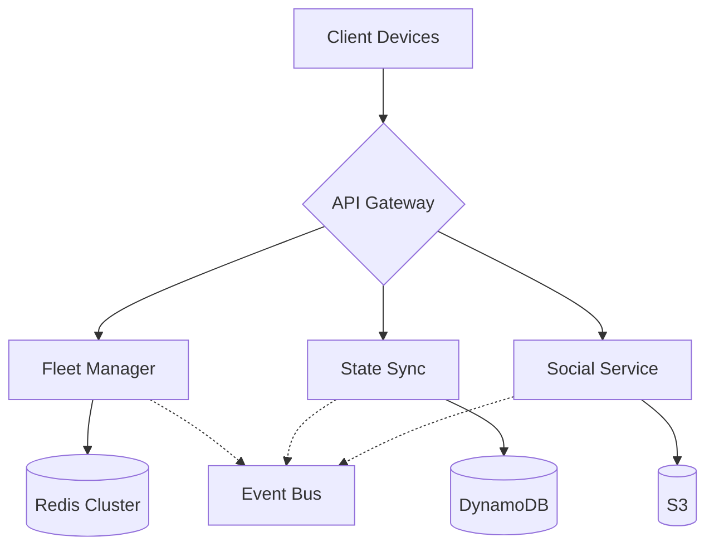
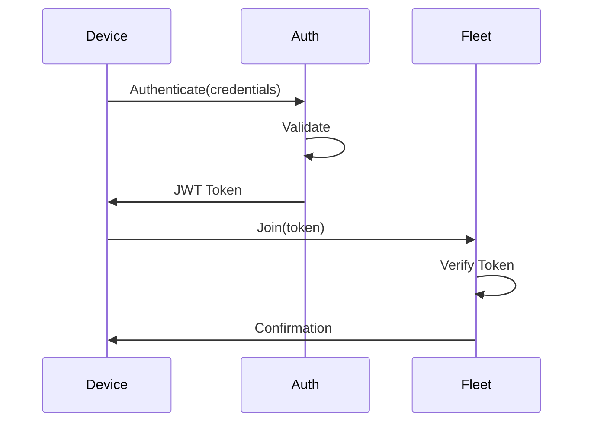

# TALD UNIA Backend Server

Enterprise-grade backend server implementation for the TALD UNIA gaming platform, providing fleet management, real-time communication, and game state synchronization services.

## Overview

TALD UNIA's backend infrastructure is built on Node.js with TypeScript, leveraging WebRTC for P2P communication and AWS services for scalability. The system supports up to 32 concurrent devices per fleet with sub-50ms latency requirements.

### Key Features

- Fleet-based multiplayer management
- Real-time state synchronization (CRDT-based)
- WebRTC signaling and P2P coordination
- LiDAR data processing and distribution
- Social platform integration
- Secure authentication and authorization

## Architecture

### Core Components



### Technology Stack

- **Runtime**: Node.js 18 LTS
- **Language**: TypeScript 5.0+
- **Real-time Communication**: WebRTC, WebSocket
- **State Management**: Automerge CRDT
- **Caching**: Redis Cluster
- **Persistence**: AWS DynamoDB
- **Object Storage**: AWS S3
- **Container Runtime**: Docker
- **Orchestration**: Kubernetes

## Prerequisites

- Node.js 18 LTS
- Redis 7.0+
- AWS CLI configured
- Docker 24.0+
- Kubernetes 1.26+

## Installation

### Development Setup

```bash
# Clone repository
git clone <repository-url>
cd src/backend

# Install dependencies
npm install

# Setup environment
cp .env.example .env
# Configure environment variables

# Start development server
npm run dev
```

### Production Setup

```bash
# Build production assets
npm run build

# Start production server
npm run start:prod

# Using Docker
docker-compose up -d
```

## Development

### Environment Variables

```bash
# Required environment variables
NODE_ENV=development
PORT=3000
AWS_REGION=us-west-2
REDIS_CLUSTER_URLS=["redis://localhost:6379"]
JWT_SECRET=your-secret-key
FLEET_SIZE_LIMIT=32
```

### Code Style

- ESLint configuration with TypeScript support
- Prettier for code formatting
- Husky for pre-commit hooks
- Conventional commits required

### Testing

```bash
# Run unit tests
npm run test

# Run integration tests
npm run test:integration

# Generate coverage report
npm run test:coverage
```

Coverage requirements:
- Statements: 90%
- Branches: 85%
- Functions: 90%
- Lines: 90%

## API Documentation

### REST Endpoints

| Endpoint | Method | Description | Rate Limit |
|----------|---------|-------------|------------|
| /fleet/create | POST | Create new fleet | 10/min |
| /fleet/join | POST | Join existing fleet | 10/min |
| /fleet/leave | POST | Leave current fleet | 10/min |
| /session/sync | WebSocket | State synchronization | 20/sec |

### WebSocket Events

| Event | Direction | Description |
|-------|-----------|-------------|
| fleet:join | client→server | Join fleet request |
| fleet:state | bidirectional | State update |
| fleet:leave | client→server | Leave fleet |
| error | server→client | Error notification |

## Security

### Authentication Flow



### Security Controls

- OAuth 2.0 + JWT authentication
- Role-based access control (RBAC)
- TLS 1.3 encryption
- Rate limiting per endpoint
- Input validation and sanitization
- CORS configuration
- Security headers

## Monitoring

### Metrics Collection

- Request latency
- WebSocket connections
- Fleet sizes
- Error rates
- Resource utilization

### Health Checks

```bash
# Endpoint: /health
GET /health/live # Liveness probe
GET /health/ready # Readiness probe
```

### Logging

- Winston for structured logging
- Log levels: error, warn, info, debug
- AWS CloudWatch integration
- Request ID tracking

## Deployment

### Kubernetes Deployment

```yaml
# Example deployment configuration
apiVersion: apps/v1
kind: Deployment
metadata:
  name: tald-backend
spec:
  replicas: 3
  selector:
    matchLabels:
      app: tald-backend
  template:
    metadata:
      labels:
        app: tald-backend
    spec:
      containers:
      - name: tald-backend
        image: tald-backend:latest
        ports:
        - containerPort: 3000
```

### Scaling Configuration

- Horizontal pod autoscaling
- CPU threshold: 70%
- Memory threshold: 80%
- Minimum replicas: 3
- Maximum replicas: 10

## Contributing

1. Fork the repository
2. Create feature branch
3. Commit changes (conventional commits)
4. Run tests
5. Submit pull request

## License

Copyright © 2023 TALD UNIA. All rights reserved.