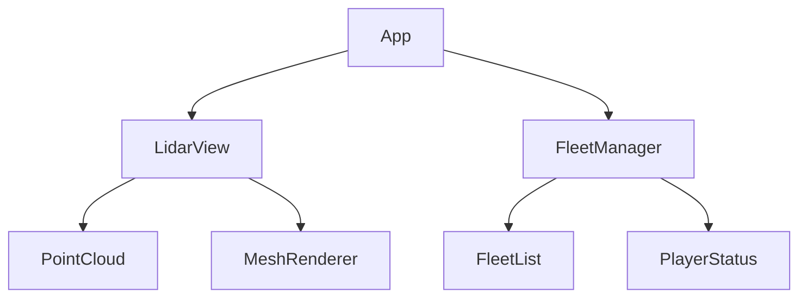
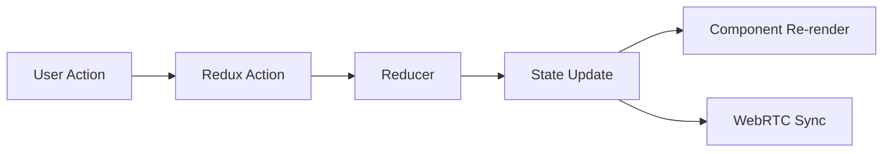

# TALD UNIA Web Platform Frontend

## Overview

TALD UNIA's web platform frontend is a high-performance React-based mixed-reality gaming interface that provides seamless integration with LiDAR scanning, fleet management, and real-time multiplayer features. Built with TypeScript and optimized for 60+ FPS performance, it delivers an immersive gaming experience while maintaining enterprise-grade code quality and security standards.

## Prerequisites

- Node.js >= 18.0.0
- npm >= 9.0.0
- Git
- Modern web browser with WebGL 2.0 support

### Core Dependencies

```json
{
  "react": "^18.2.0",
  "typescript": "^5.0.0",
  "vite": "^4.0.0",
  "three.js": "^0.150.0",
  "webrtc-adapter": "^8.2.0",
  "@microsoft/fast-components": "^2.30.0"
}
```

## Installation

1. Clone the repository:
```bash
git clone https://github.com/your-org/tald-unia.git
cd tald-unia/src/web
```

2. Install dependencies:
```bash
npm install
```

3. Configure environment:
```bash
cp .env.example .env
```

4. Start development server:
```bash
npm run dev
```

## Development

### Available Commands

```bash
npm run dev          # Start development server
npm run build        # Create production build
npm run test         # Run test suite
npm run test:e2e     # Run E2E tests
npm run lint         # Lint code
npm run type-check   # Run TypeScript checks
```

### Project Structure

```
src/
├── components/          # React components
│   ├── LidarView/      # LiDAR visualization components
│   ├── FleetManager/   # Fleet management interface
│   └── shared/         # Shared UI components
├── services/           # Business logic services
├── hooks/              # Custom React hooks
├── store/             # State management
├── utils/             # Utility functions
└── types/             # TypeScript definitions
```

## Performance Optimization

### React Rendering Optimization

- Use React.memo() for expensive components
- Implement virtualization for large lists
- Optimize context usage with selective subscriptions
- Employ lazy loading for route-based code splitting

### WebGL Performance

```typescript
// Example WebGL optimization configuration
const glConfig = {
  antialias: false,
  powerPreference: 'high-performance',
  preserveDrawingBuffer: false,
  desynchronized: true
};
```

### State Management Guidelines

- Use local state for UI-specific data
- Implement Redux for global game state
- Utilize WebRTC data channels for real-time updates
- Cache LiDAR data with WebAssembly processing

## Testing

### Unit Testing

```typescript
// Example component test
describe('LidarView', () => {
  it('should render point cloud data', async () => {
    const pointCloud = generateMockPointCloud();
    render(<LidarView data={pointCloud} />);
    await waitFor(() => {
      expect(screen.getByTestId('point-cloud')).toBeInTheDocument();
    });
  });
});
```

### E2E Testing

```typescript
// Example Cypress test
describe('Fleet Management', () => {
  it('should join fleet successfully', () => {
    cy.visit('/fleet');
    cy.getByTestId('join-fleet-btn').click();
    cy.getByTestId('fleet-status').should('contain', 'Connected');
  });
});
```

## Building

### Production Build Configuration

```typescript
// vite.config.ts optimization settings
export default defineConfig({
  build: {
    target: 'esnext',
    minify: 'terser',
    rollupOptions: {
      output: {
        manualChunks: {
          'vendor': ['react', 'react-dom'],
          'three': ['three'],
        }
      }
    }
  }
});
```

## Architecture

### Component Architecture



### State Flow



## Security

### Security Best Practices

- Implement Content Security Policy (CSP)
- Sanitize WebGL shader inputs
- Validate WebRTC peer connections
- Encrypt sensitive data in transit
- Regular security audits

## Contributing

### Development Standards

- Follow Airbnb JavaScript Style Guide
- Write comprehensive tests
- Document complex algorithms
- Review performance implications
- Maintain accessibility standards

### Code Review Process

1. Create feature branch
2. Submit PR with detailed description
3. Pass automated checks
4. Obtain two technical reviews
5. Verify performance metrics
6. Merge after approval

## Troubleshooting

### Common Issues

| Issue | Solution |
|-------|----------|
| WebGL Context Lost | Implement context restoration handler |
| Memory Leaks | Properly dispose Three.js objects |
| Performance Drops | Profile with React DevTools |
| WebRTC Connection | Check STUN/TURN configuration |

### Performance Monitoring

```typescript
// Example performance monitoring
if (process.env.NODE_ENV === 'production') {
  const reportWebVitals = (metric) => {
    console.log(metric);
    // Send to analytics
  };
}
```

## License

Copyright © 2023 TALD UNIA. All rights reserved.